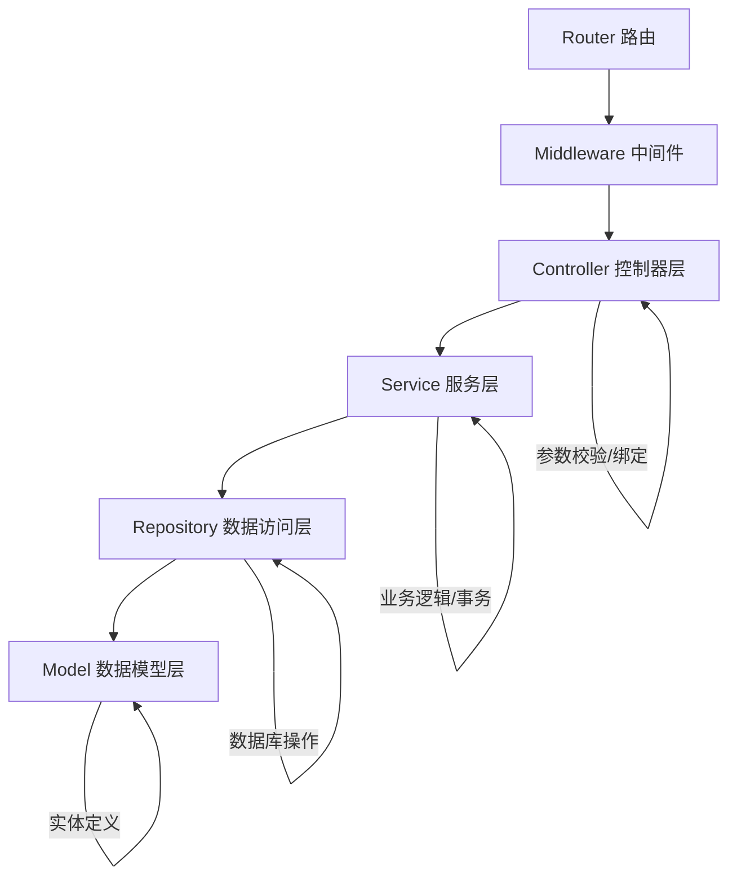

# 后端架构设计

## 目录结构

```
server/
├── main.go                    # 程序入口
├── go.mod
├── go.sum
├── config/
│   ├── config.go              # 配置结构体定义
│   └── config.yaml            # 配置文件
├── global/
│   └── global.go              # 全局变量（DB、Redis、Logger等）
├── initialize/
│   ├── db.go                  # 数据库初始化
│   ├── redis.go               # Redis 初始化
│   ├── logger.go              # Zap 日志初始化
│   ├── router.go              # 路由初始化
│   └── viper.go               # Viper 配置初始化
├── middleware/
│   ├── auth.go                # JWT 认证中间件
│   ├── cors.go                # 跨域中间件
│   ├── operation_log.go       # 操作日志中间件
│   ├── data_scope.go          # 数据权限中间件
│   └── rate_limit.go          # 限流中间件
├── model/
│   ├── request/               # 请求参数结构体
│   │   ├── user.go
│   │   ├── role.go
│   │   ├── menu.go
│   │   ├── dept.go
│   │   └── common.go          # 分页等通用请求结构体
│   ├── response/              # 响应结构体
│   │   ├── common.go          # 统一响应 {code, msg, data}
│   │   └── ...
│   ├── entity/                # 数据库实体
│   │   ├── user.go
│   │   ├── role.go
│   │   ├── menu.go
│   │   ├── dept.go
│   │   ├── operation_log.go
│   │   └── login_log.go
│   └── dto/                   # 数据传输对象
│       └── ...
├── repository/                # 数据访问层
│   ├── user.go
│   ├── role.go
│   ├── menu.go
│   ├── dept.go
│   ├── operation_log.go
│   └── login_log.go
├── service/                   # 业务逻辑层
│   ├── auth.go                # 认证服务
│   ├── user.go
│   ├── role.go
│   ├── menu.go
│   ├── dept.go
│   ├── system_monitor.go      # 系统监控服务
│   ├── operation_log.go
│   ├── login_log.go
│   └── codegen.go             # 代码生成服务
├── controller/                # 控制器层
│   ├── auth.go
│   ├── user.go
│   ├── role.go
│   ├── menu.go
│   ├── dept.go
│   ├── system_monitor.go
│   ├── operation_log.go
│   ├── login_log.go
│   └── codegen.go
├── router/                    # 路由定义
│   ├── router.go              # 路由总入口
│   ├── auth.go
│   ├── user.go
│   ├── role.go
│   ├── menu.go
│   ├── dept.go
│   ├── system_monitor.go
│   └── codegen.go
├── utils/
│   ├── jwt.go                 # JWT 工具
│   ├── bcrypt.go              # 密码加密
│   ├── response.go            # 统一响应工具
│   ├── pagination.go          # 分页工具
│   ├── data_scope.go          # 数据权限工具
│   └── desensitize.go         # 数据脱敏工具（手机号、邮箱、身份证等）
├── sql/
│   ├── init.sql               # 初始化建表脚本
│   └── seed.sql               # 初始数据（管理员账号、默认角色等）
└── template/                  # 代码生成模板
    ├── backend/
    │   ├── model.go.tpl
    │   ├── repository.go.tpl
    │   ├── service.go.tpl
    │   ├── controller.go.tpl
    │   └── router.go.tpl
    └── frontend/
        ├── api.ts.tpl
        ├── list.vue.tpl
        └── form.vue.tpl
```

---

## 分层职责



| 层级 | 职责 | 依赖 |
|------|------|------|
| **Router** | 路由注册、中间件挂载 | Controller, Middleware |
| **Middleware** | 认证、日志、跨域、限流 | Service, Utils |
| **Controller** | 参数绑定、校验、调用 Service、返回响应 | Service, Model/Request, Model/Response |
| **Service** | 业务逻辑、事务管理、权限校验 | Repository, Model/Entity |
| **Repository** | 数据库 CRUD 操作、查询构建 | Model/Entity, GORM |
| **Model** | 实体定义、请求/响应结构体 | 无 |

---

## 统一响应格式

```go
// model/response/common.go
type Response struct {
    Code int         `json:"code"`    // 状态码：0=成功，非0=失败
    Msg  string      `json:"msg"`     // 提示信息
    Data interface{} `json:"data"`    // 数据
}

// 分页响应
type PageResponse struct {
    Code  int         `json:"code"`
    Msg   string      `json:"msg"`
    Data  interface{} `json:"data"`
    Total int64       `json:"total"`  // 总记录数
    Page  int         `json:"page"`   // 当前页
    Size  int         `json:"size"`   // 每页大小
}
```

---

## 错误码设计

| 范围 | 说明 | 示例 |
|------|------|------|
| 0 | 成功 | 操作成功 |
| 1000-1999 | 认证相关 | 1001=Token过期, 1002=无权限 |
| 2000-2999 | 参数错误 | 2001=参数校验失败 |
| 3000-3999 | 业务错误 | 3001=用户已存在 |
| 5000-5999 | 系统错误 | 5001=数据库错误 |

---

## 配置文件结构 (config.yaml)

```yaml
server:
  port: 8080
  mode: debug              # debug / release / test

# 数据库表前缀，为空则不加前缀
# 例如设置为 xy_，则表名变为 xy_user, xy_role 等
table_prefix: xy_

database:
  type: sqlite             # sqlite / mysql / postgres / oracle
  sqlite:
    path: ./data/go-admin.db
  mysql:
    host: 127.0.0.1
    port: 3306
    username: root
    password: ""
    dbname: go_admin
  postgres:
    host: 127.0.0.1
    port: 5432
    username: postgres
    password: ""
    dbname: go_admin
  oracle:
    host: 127.0.0.1
    port: 1521
    username: ""
    password: ""
    dbname: go_admin

redis:
  addr: 127.0.0.1:6379
  password: ""
  db: 0

jwt:
  secret: your-secret-key
  expire: 7200             # Token 过期时间（秒）
  refresh: 604800          # 刷新过期时间（秒）

log:
  level: info              # debug / info / warn / error
  path: ./logs
  max_size: 100            # 单文件最大 MB
  max_backups: 30          # 最大备份数
  max_age: 7               # 最大保留天数

codegen:
  output: ./output         # 代码生成输出目录
```

### 表前缀机制说明

- 配置项 `table_prefix` 控制所有数据库表的前缀
- GORM 的 `TableName()` 方法会自动拼接前缀 + 原始表名
- SQL 建表脚本中使用 `{{.TablePrefix}}` 模板变量动态生成带前缀的表名
- 代码生成器也会自动读取前缀配置，生成的代码中表名自动带前缀
- 示例：`table_prefix: xy_` → `xy_user`, `xy_role`, `xy_menu`, `xy_dept` 等

---

## 关键依赖包

```go
// go.mod 关键依赖
require (
    github.com/gin-gonic/gin              // Web 框架
    gorm.io/gorm                           // ORM
    modernc.org/sqlite                     // SQLite 纯 Go 驱动
    github.com/glebarez/go-sqlite          // GORM SQLite dialector
    github.com/redis/go-redis/v9           // Redis 客户端
    github.com/spf13/viper                 // 配置管理
    go.uber.org/zap                        // 日志
    gopkg.in/natefinch/lumberjack.v2       // 日志切割
    github.com/golang-jwt/jwt/v5           // JWT
    golang.org/x/crypto                    // bcrypt 密码加密
    github.com/shirou/gopsutil/v3          // 系统监控
    github.com/Masterminds/sprig/v3        // 模板函数增强
    github.com/gin-contrib/cors            // CORS 中间件
)
```
