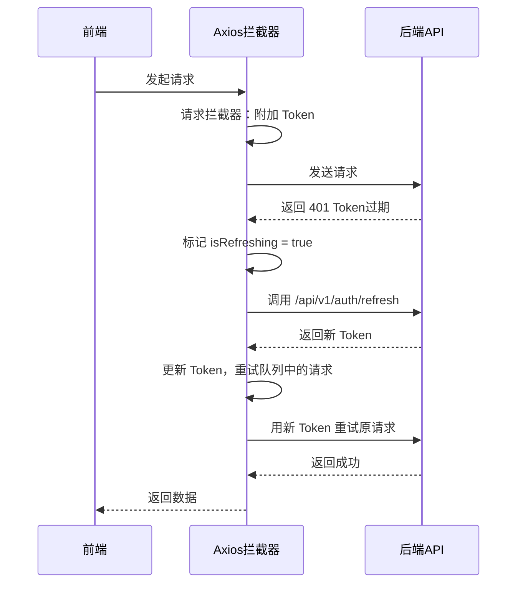
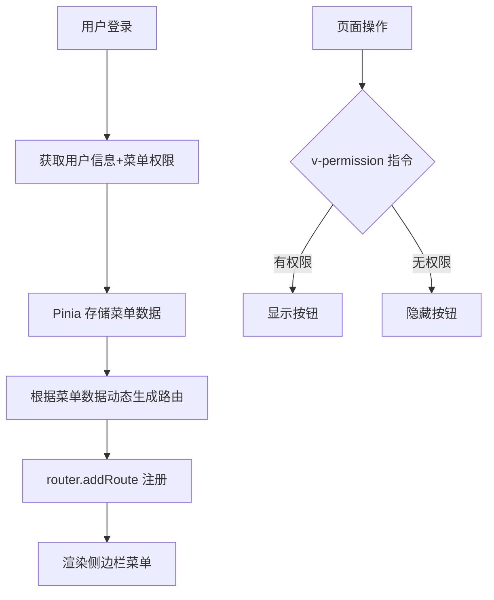

# 前端架构设计

## 目录结构

```
web/
├── index.html
├── package.json
├── vite.config.ts
├── tailwind.config.js
├── postcss.config.js
├── tsconfig.json
├── .env                        # 环境变量
├── .env.development            # 开发环境
├── .env.production             # 生产环境
├── public/
│   └── favicon.ico
├── src/
│   ├── main.ts                 # 入口文件
│   ├── App.vue                 # 根组件
│   ├── api/                    # API 接口层
│   │   ├── index.ts            # Axios 实例配置
│   │   ├── auth.ts             # 认证相关 API
│   │   ├── user.ts
│   │   ├── role.ts
│   │   ├── menu.ts
│   │   ├── dept.ts
│   │   ├── monitor.ts          # 系统监控 API
│   │   └── codegen.ts          # 代码生成 API
│   ├── assets/
│   │   ├── styles/
│   │   │   ├── index.css       # 全局样式
│   │   │   ├── tailwind.css    # Tailwind 入口
│   │   │   └── variables.css   # CSS 变量（主题色）
│   │   └── images/
│   ├── components/             # 公共组件
│   │   ├── Breadcrumb.vue
│   │   ├── Pagination.vue
│   │   ├── IconSelect.vue      # 图标选择器
│   │   ├── SvgIcon.vue
│   │   └── RightPanel.vue      # 右侧设置面板
│   ├── composables/            # 组合式函数
│   │   ├── useAuth.ts          # 认证相关
│   │   ├── usePermission.ts    # 权限判断
│   │   ├── usePagination.ts    # 分页逻辑
│   │   └── useTheme.ts         # 主题切换
│   ├── directives/             # 自定义指令
│   │   └── permission.ts       # v-permission 按钮权限指令
│   ├── hooks/
│   │   └── useTable.ts         # 表格通用 Hook
│   ├── i18n/                   # 国际化
│   │   ├── index.ts
│   │   ├── zh-CN/
│   │   │   ├── index.ts
│   │   │   ├── common.ts       # 通用文案
│   │   │   ├── menu.ts         # 菜单文案
│   │   │   └── modules/        # 各模块文案
│   │   │       ├── user.ts
│   │   │       ├── role.ts
│   │   │       └── ...
│   │   └── en/
│   │       ├── index.ts
│   │       ├── common.ts
│   │       ├── menu.ts
│   │       └── modules/
│   ├── layout/                 # 布局组件
│   │   ├── index.vue           # 主布局
│   │   ├── components/
│   │   │   ├── Sidebar.vue         # 左侧菜单
│   │   │   ├── SidebarItem.vue     # 菜单项（递归）
│   │   │   ├── Navbar.vue          # 顶部导航
│   │   │   ├── TagsView.vue        # 标签页导航
│   │   │   ├── AppMain.vue         # 内容区
│   │   │   └── SettingsPanel.vue   # 主题设置面板
│   │   └── hooks/
│   │       └── useResize.ts    # 响应式布局 Hook
│   ├── plugins/
│   │   ├── element.ts          # Element-Plus 按需引入
│   │   └── tailwindcss.ts
│   ├── router/                 # 路由
│   │   ├── index.ts            # 路由实例
│   │   ├── staticRoutes.ts     # 静态路由（登录、404等）
│   │   └── guard.ts            # 路由守卫
│   ├── store/                  # Pinia 状态管理
│   │   ├── index.ts
│   │   ├── modules/
│   │   │   ├── user.ts         # 用户信息、Token
│   │   │   ├── permission.ts   # 动态路由、按钮权限
│   │   │   ├── app.ts          # 应用设置（主题、语言）
│   │   │   └── tagsView.ts     # 标签页状态
│   ├── types/                  # TypeScript 类型定义
│   │   ├── api.d.ts            # API 响应类型
│   │   ├── router.d.ts
│   │   ├── store.d.ts
│   │   └── global.d.ts
│   ├── utils/
│   │   ├── request.ts          # Axios 封装（Token 刷新）
│   │   ├── auth.ts             # Token 存取
│   │   ├── validate.ts         # 表单校验规则
│   │   ├── dict.ts             # 字典工具
│   │   └── download.ts         # 文件下载
│   └── views/                  # 页面视图
│       ├── login/
│       │   └── index.vue
│       ├── dashboard/
│       │   └── index.vue
│       ├── system/
│       │   ├── user/
│       │   │   ├── index.vue       # 用户列表
│       │   │   └── components/
│       │   │       └── UserForm.vue
│       │   ├── role/
│       │   ├── menu/
│       │   └── dept/
│       ├── monitor/
│       │   ├── server/
│       │   │   └── index.vue       # 服务器监控
│       │   ├── operation-log/
│       │   │   └── index.vue
│       │   └── login-log/
│       │       └── index.vue
│       ├── codegen/
│       │   ├── index.vue           # 代码生成配置
│       │   └── components/
│       │       ├── TableConfig.vue  # 表配置
│       │       └── FieldConfig.vue  # 字段配置
│       └── error/
│           ├── 404.vue
│           └── 403.vue
```

---

## 核心设计

### 1. Axios 封装与 Token 无感刷新



**关键逻辑：**
- 请求拦截器：自动在 Header 中附加 `Authorization: Bearer <token>`
- 响应拦截器：捕获 401 错误，自动调用刷新接口
- 刷新期间其他请求排队等待，刷新完成后统一重试
- 刷新失败则跳转登录页

### 2. 动态路由与权限



### 3. 主题系统

| 功能 | 实现方式 |
|------|----------|
| 暗黑模式 | CSS `prefers-color-scheme` + Element-Plus 暗黑主题 |
| 主题色 | CSS 变量 `--el-color-primary` 动态修改 |
| 侧边栏配色 | 独立的深色/浅色侧边栏配色方案 |
| 持久化 | 用户偏好存 localStorage |

### 4. 响应式布局

| 断点 | 宽度 | 布局行为 |
|------|------|----------|
| Mobile | < 768px | 侧边栏遮罩弹出，隐藏标签页 |
| Tablet | 768px - 1024px | 侧边栏收起为图标模式 |
| Desktop | > 1024px | 完整布局 |

---

## 路由设计

### 静态路由（无需权限）

| 路径 | 组件 | 说明 |
|------|------|------|
| `/login` | Login | 登录页 |
| `/404` | 404 | 页面不存在 |
| `/403` | 403 | 无权限 |

### 动态路由（从后端菜单数据生成）

| 路径 | 组件 | 说明 |
|------|------|------|
| `/dashboard` | Dashboard | 首页仪表盘 |
| `/system/user` | SystemUser | 用户管理 |
| `/system/role` | SystemRole | 角色管理 |
| `/system/menu` | SystemMenu | 菜单管理 |
| `/system/dept` | SystemDept | 部门管理 |
| `/monitor/server` | MonitorServer | 服务器监控 |
| `/monitor/operation-log` | OperationLog | 操作日志 |
| `/monitor/login-log` | LoginLog | 登录日志 |
| `/codegen` | CodeGen | 代码生成 |

---

## 国际化方案

```
i18n/
├── zh-CN/
│   ├── common.ts       # 通用：确定、取消、新增、编辑、删除...
│   ├── menu.ts         # 菜单名：用户管理、角色管理...
│   └── modules/
│       ├── user.ts     # 用户模块：用户名、邮箱、手机号...
│       └── role.ts     # 角色模块：角色名、权限字符...
└── en/
    ├── common.ts
    ├── menu.ts
    └── modules/
        ├── user.ts
        └── role.ts
```

- 使用 `vue-i18n` 的 Composition API 模式
- 语言偏好存 localStorage，刷新后保持
- 顶部导航栏提供语言切换按钮
