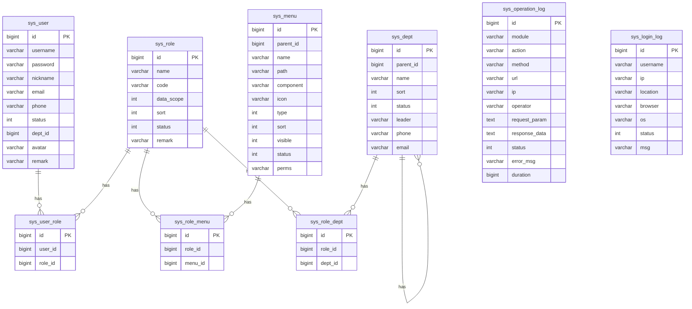

# 数据库设计

## 设计原则

1. **不使用数据库外键**，关联关系由代码层维护
2. **SQL 脚本手动建表**，不使用 GORM AutoMigrate
3. **先支持 SQLite**，预留多数据库扩展能力
4. 所有表包含通用字段：`id`, `created_at`, `updated_at`, `deleted_at`（软删除）
5. **表名支持可配置前缀**，通过 `config.yaml` 中的 `table_prefix` 配置（如 `xy_`），为空则不加前缀
6. **敏感数据脱敏**，API 响应中手机号、邮箱等字段自动脱敏；密码使用 bcrypt 加密存储

---

## 表结构总览



---

## 详细表结构

### 1. {prefix}user（用户表）

> 实际表名由配置决定，例如 `xy_user`、`user`（无前缀）

| 字段 | 类型 | 说明 |
|------|------|------|
| id | INTEGER PRIMARY KEY | 主键 |
| username | VARCHAR(64) NOT NULL | 用户名（登录账号） |
| password | VARCHAR(128) NOT NULL | 密码（bcrypt 加密存储，API 响应中不返回） |
| nickname | VARCHAR(64) | 昵称 |
| email | VARCHAR(128) | 邮箱（API 响应中脱敏：z***@example.com） |
| phone | VARCHAR(20) | 手机号（API 响应中脱敏：138****8000） |
| status | INTEGER DEFAULT 1 | 状态：0=禁用 1=正常 |
| dept_id | INTEGER | 部门ID |
| avatar | VARCHAR(256) | 头像URL |
| remark | VARCHAR(512) | 备注 |
| created_at | DATETIME | 创建时间 |
| updated_at | DATETIME | 更新时间 |
| deleted_at | DATETIME | 软删除时间 |

**索引：**
- `idx_user_username` UNIQUE ON username
- `idx_user_dept_id` ON dept_id

### 2. {prefix}role（角色表）

| 字段 | 类型 | 说明 |
|------|------|------|
| id | INTEGER PRIMARY KEY | 主键 |
| name | VARCHAR(64) NOT NULL | 角色名称 |
| code | VARCHAR(64) NOT NULL | 角色标识（如 admin, editor） |
| data_scope | INTEGER DEFAULT 1 | 数据权限范围：1=全部 2=本部门 3=本部门及下级 4=仅本人 5=自定义 |
| sort | INTEGER DEFAULT 0 | 排序 |
| status | INTEGER DEFAULT 1 | 状态：0=禁用 1=正常 |
| remark | VARCHAR(512) | 备注 |
| created_at | DATETIME | 创建时间 |
| updated_at | DATETIME | 更新时间 |
| deleted_at | DATETIME | 软删除时间 |

**索引：**
- `idx_role_code` UNIQUE ON code

### 3. {prefix}menu（菜单表）

| 字段 | 类型 | 说明 |
|------|------|------|
| id | INTEGER PRIMARY KEY | 主键 |
| parent_id | INTEGER DEFAULT 0 | 父菜单ID（0=顶级） |
| name | VARCHAR(64) NOT NULL | 菜单名称 |
| path | VARCHAR(128) | 路由路径 |
| component | VARCHAR(128) | 前端组件路径 |
| icon | VARCHAR(64) | 图标 |
| type | INTEGER | 类型：0=目录 1=菜单 2=按钮 |
| sort | INTEGER DEFAULT 0 | 排序 |
| visible | INTEGER DEFAULT 1 | 是否可见：0=隐藏 1=显示 |
| status | INTEGER DEFAULT 1 | 状态：0=禁用 1=正常 |
| perms | VARCHAR(128) | 权限标识（如 system:user:list） |
| created_at | DATETIME | 创建时间 |
| updated_at | DATETIME | 更新时间 |
| deleted_at | DATETIME | 软删除时间 |

### 4. {prefix}dept（部门表）

| 字段 | 类型 | 说明 |
|------|------|------|
| id | INTEGER PRIMARY KEY | 主键 |
| parent_id | INTEGER DEFAULT 0 | 父部门ID（0=顶级） |
| name | VARCHAR(64) NOT NULL | 部门名称 |
| sort | INTEGER DEFAULT 0 | 排序 |
| status | INTEGER DEFAULT 1 | 状态：0=禁用 1=正常 |
| leader | VARCHAR(64) | 负责人 |
| phone | VARCHAR(20) | 联系电话 |
| email | VARCHAR(128) | 邮箱 |
| created_at | DATETIME | 创建时间 |
| updated_at | DATETIME | 更新时间 |
| deleted_at | DATETIME | 软删除时间 |

### 5. {prefix}user_role（用户角色关联表）

| 字段 | 类型 | 说明 |
|------|------|------|
| id | INTEGER PRIMARY KEY | 主键 |
| user_id | INTEGER NOT NULL | 用户ID |
| role_id | INTEGER NOT NULL | 角色ID |

**索引：**
- `idx_user_role` UNIQUE ON (user_id, role_id)

### 6. {prefix}role_menu（角色菜单关联表）

| 字段 | 类型 | 说明 |
|------|------|------|
| id | INTEGER PRIMARY KEY | 主键 |
| role_id | INTEGER NOT NULL | 角色ID |
| menu_id | INTEGER NOT NULL | 菜单ID |

**索引：**
- `idx_role_menu` UNIQUE ON (role_id, menu_id)

### 7. {prefix}role_dept（角色部门关联表 - 数据权限自定义用）

| 字段 | 类型 | 说明 |
|------|------|------|
| id | INTEGER PRIMARY KEY | 主键 |
| role_id | INTEGER NOT NULL | 角色ID |
| dept_id | INTEGER NOT NULL | 部门ID |

**索引：**
- `idx_role_dept` UNIQUE ON (role_id, dept_id)

### 8. {prefix}operation_log（操作日志表）

| 字段 | 类型 | 说明 |
|------|------|------|
| id | INTEGER PRIMARY KEY | 主键 |
| module | VARCHAR(64) | 操作模块 |
| action | VARCHAR(64) | 操作类型（新增/修改/删除/查询） |
| method | VARCHAR(10) | 请求方法（GET/POST/PUT/DELETE） |
| url | VARCHAR(256) | 请求URL |
| ip | VARCHAR(64) | 操作IP |
| operator | VARCHAR(64) | 操作人 |
| request_param | TEXT | 请求参数 |
| response_data | TEXT | 响应数据 |
| status | INTEGER | 操作状态：0=失败 1=成功 |
| error_msg | VARCHAR(512) | 错误信息 |
| duration | INTEGER | 耗时（毫秒） |
| created_at | DATETIME | 操作时间 |

**索引：**
- `idx_oplog_created_at` ON created_at
- `idx_oplog_operator` ON operator

### 9. {prefix}login_log（登录日志表）

| 字段 | 类型 | 说明 |
|------|------|------|
| id | INTEGER PRIMARY KEY | 主键 |
| username | VARCHAR(64) | 登录用户名 |
| ip | VARCHAR(64) | 登录IP |
| location | VARCHAR(128) | 登录地点 |
| browser | VARCHAR(64) | 浏览器 |
| os | VARCHAR(64) | 操作系统 |
| status | INTEGER | 登录状态：0=失败 1=成功 |
| msg | VARCHAR(256) | 提示消息 |
| created_at | DATETIME | 登录时间 |

**索引：**
- `idx_loginlog_created_at` ON created_at
- `idx_loginlog_username` ON username

---

## 初始数据（seed.sql）

### 默认管理员账号
- 用户名：`admin`
- 密码：`admin123`（bcrypt 加密）
- 角色：超级管理员

### 默认角色
| 角色名 | 标识 | 数据权限 |
|--------|------|----------|
| 超级管理员 | admin | 全部数据 |
| 普通用户 | user | 仅本人数据 |

### 默认菜单结构
```
├── 系统管理（目录）
│   ├── 用户管理（菜单）→ /system/user
│   │   ├── 用户查询（按钮）→ system:user:list
│   │   ├── 用户新增（按钮）→ system:user:add
│   │   ├── 用户修改（按钮）→ system:user:edit
│   │   └── 用户删除（按钮）→ system:user:delete
│   ├── 角色管理（菜单）→ /system/role
│   │   └── ...（同上模式）
│   ├── 菜单管理（菜单）→ /system/menu
│   │   └── ...
│   └── 部门管理（菜单）→ /system/dept
│       └── ...
├── 系统监控（目录）
│   ├── 服务器监控（菜单）→ /monitor/server
│   ├── 操作日志（菜单）→ /monitor/operation-log
│   └── 登录日志（菜单）→ /monitor/login-log
└── 代码生成（目录）
    └── 代码生成（菜单）→ /codegen
```

### 默认部门
```
总公司
└── 默认部门
```
