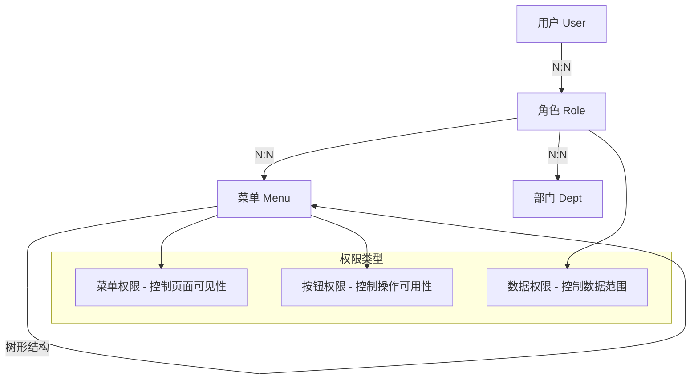
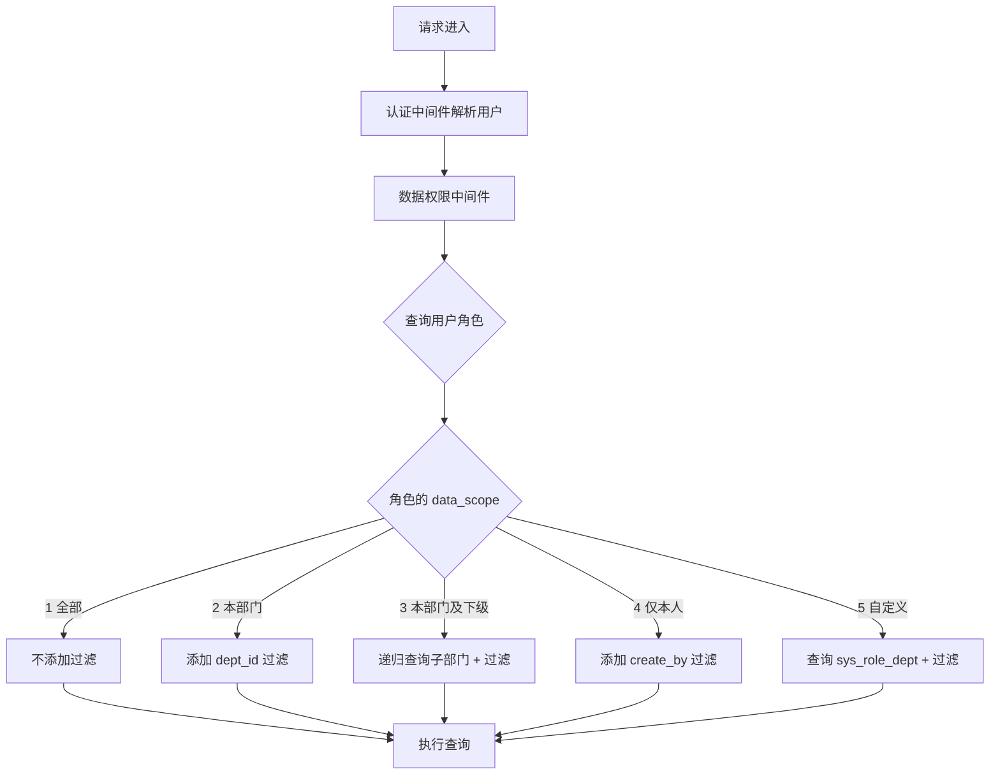
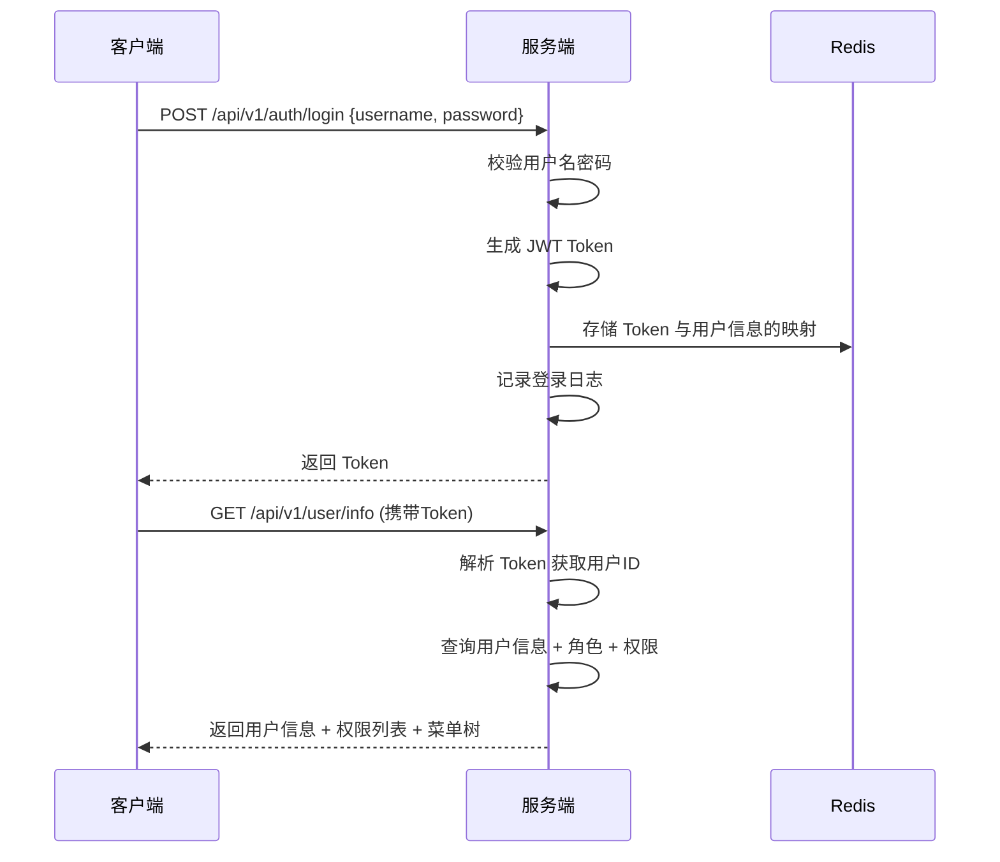
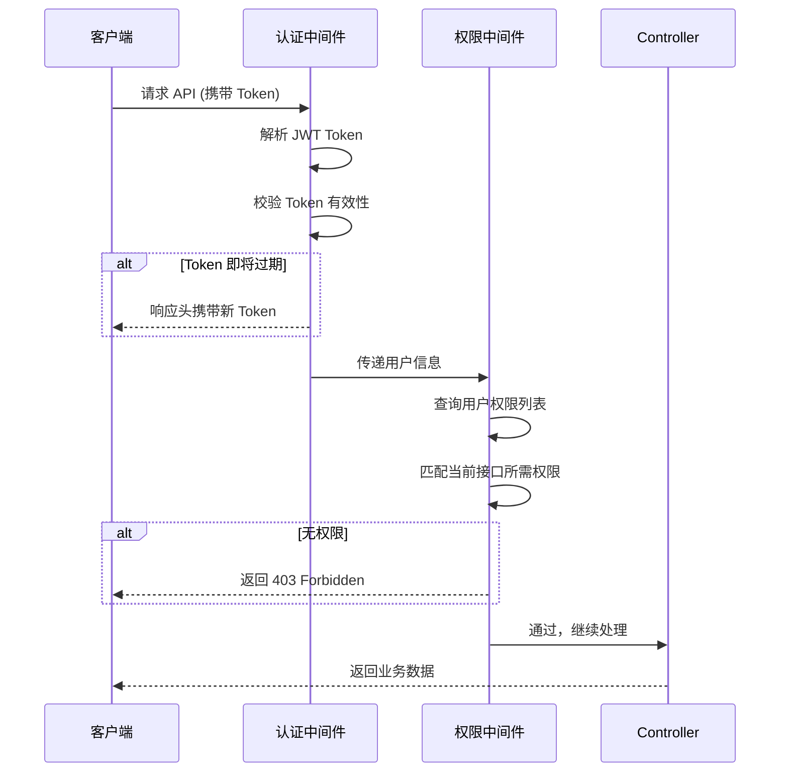

# RBAC 权限设计

## 权限模型总览



---

## 一、菜单权限

### 工作流程

```mermaid
sequenceDiagram
    participant B as 浏览器
    participant F as 前端
    participant S as 后端

    B->>F: 访问系统
    F->>S: GET /api/v1/user/menus
    S->>S: 查询用户角色 → 查询角色关联的菜单
    S-->>F: 返回菜单树 JSON
    F->>F: 根据菜单树动态生成路由
    F->>F: router.addRoute 注册路由
    F->>F: 渲染侧边栏菜单
```



### 菜单类型

| type 值 | 类型 | 说明 | 示例 |
|---------|------|------|------|
| 0 | 目录 | 用于菜单分组，无实际页面 | 系统管理 |
| 1 | 菜单 | 对应一个页面路由 | 用户管理 → /system/user |
| 2 | 按钮 | 页面内的操作权限 | 新增用户 → system:user:add |

### 菜单数据结构

```json
{
  "id": 1,
  "parentId": 0,
  "name": "系统管理",
  "path": "/system",
  "component": "",
  "icon": "setting",
  "type": 0,
  "sort": 1,
  "children": [
    {
      "id": 2,
      "parentId": 1,
      "name": "用户管理",
      "path": "user",
      "component": "system/user/index",
      "icon": "user",
      "type": 1,
      "sort": 1,
      "children": [
        {
          "id": 10,
          "parentId": 2,
          "name": "用户查询",
          "perms": "system:user:list",
          "type": 2,
          "sort": 1
        }
      ]
    }
  ]
}
```

---

## 二、按钮权限

### 实现方式

**前端：** 自定义指令 `v-permission`

```typescript
// directives/permission.ts
// 使用方式：<el-button v-permission="'system:user:add'">新增</el-button>
// 使用方式：<el-button v-permission="['system:user:add', 'system:user:edit']">操作</el-button>
```

**后端：** 中间件校验

```go
// middleware/auth.go
// 从 JWT 中解析用户ID → 查询角色 → 查询权限标识 → 校验接口权限
```

### 权限标识命名规范

```
{模块}:{资源}:{操作}

示例：
system:user:list      # 查询用户列表
system:user:add       # 新增用户
system:user:edit      # 修改用户
system:user:delete    # 删除用户
system:user:export    # 导出用户
system:role:list      # 查询角色列表
system:menu:list      # 查询菜单列表
monitor:log:list      # 查询日志
codegen:generate      # 生成代码
```

---

## 三、数据权限

### 数据权限范围

| data_scope 值 | 范围 | SQL 逻辑 |
|---------------|------|----------|
| 1 | 全部数据 | 不添加部门过滤条件 |
| 2 | 本部门数据 | `WHERE dept_id = 当前用户部门ID` |
| 3 | 本部门及下级 | `WHERE dept_id IN 当前用户部门及所有子部门ID` |
| 4 | 仅本人数据 | `WHERE create_by = 当前用户ID` |
| 5 | 自定义 | `WHERE dept_id IN 角色关联的部门ID列表` |

### 实现方案



### 后端实现要点

1. **Repository 层接收数据权限参数：**

```go
// model/request/common.go
type DataScope struct {
    DataScope int     // 数据权限范围
    DeptID    int64   // 当前用户部门ID
    UserID    int64   // 当前用户ID
    DeptIDs   []int64 // 自定义部门ID列表
}
```

2. **Service 层构建数据权限查询：**

```go
// utils/data_scope.go
// 根据 DataScope 参数，向 GORM 查询中追加 WHERE 条件
// 返回 *gorm.DB（已添加过滤条件的查询构建器）
```

3. **需要数据权限控制的接口：**
   - 用户列表查询
   - 操作日志查询
   - 后续业务模块（代码生成的模块）

---

## 四、权限校验流程

### 登录流程



### 接口鉴权流程



---

## 五、Token 无感刷新方案

### 策略

- **Token 有效期：** 2 小时（7200秒）
- **刷新窗口：** Token 剩余有效期 < 30 分钟时自动刷新
- **刷新方式：** 后端在响应头 `X-New-Token` 中返回新 Token
- **最终过期：** Token 超过 7 天未刷新则彻底过期，需重新登录

### 前端刷新逻辑

```
1. Axios 响应拦截器检查响应头 X-New-Token
2. 如果有新 Token，更新本地存储
3. 如果返回 401：
   a. 如果正在刷新中，将请求加入队列等待
   b. 如果未在刷新，调用 /api/v1/auth/refresh
   c. 刷新成功：更新 Token，重试队列中的请求
   d. 刷新失败：清除 Token，跳转登录页
```
