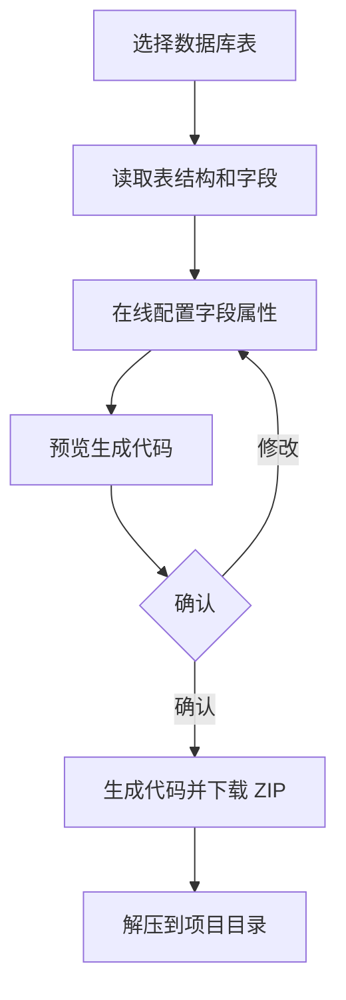

# 代码生成设计

## 功能概述

在线配置数据库表和字段信息，一键生成完整的前后端 CRUD 代码并下载。生成的代码风格与手写代码完全一致，可直接集成到项目中使用。

---

## 生成流程



---

## 字段配置项

每个字段可配置以下属性：

| 配置项 | 说明 | 可选值 |
|--------|------|--------|
| 字段名 | 数据库列名（自动读取） | - |
| 字段类型 | 数据库类型（自动读取） | - |
| Go 类型 | Go 语言类型（自动映射） | string, int, int64, float64, bool, time.Time |
| Go 字段名 | Go 结构体字段名（自动转驼峰） | - |
| TS 类型 | TypeScript 类型（自动映射） | string, number, boolean, Date |
| 显示标签 | 前端表单/表格显示名（中英文） | - |
| 表单类型 | 前端表单控件类型 | input, textarea, select, radio, checkbox, date, datetime, upload |
| 查询方式 | 列表查询的匹配方式 | =, !=, >, <, >=, <=, LIKE, BETWEEN, IN |
| 是否列表 | 是否在列表页显示 | true/false |
| 是否查询 | 是否作为查询条件 | true/false |
| 是否必填 | 表单是否必填 | true/false |
| 是否编辑 | 编辑时是否可修改 | true/false |
| 字典类型 | 如果是 select/radio，绑定的字典 | 自定义字典值 |

---

## 生成产物

### 后端代码（Go）

| 文件 | 说明 | 示例 |
|------|------|------|
| `model/entity/{table}.go` | 数据库实体 | User 结构体 |
| `model/request/{table}.go` | 请求参数结构体 | UserListReq, UserCreateReq |
| `repository/{table}.go` | 数据访问层 | UserRepository |
| `service/{table}.go` | 业务逻辑层 | UserService |
| `controller/{table}.go` | 控制器层 | UserController |
| `router/{table}.go` | 路由注册 | RegisterUserRoutes |
| `sql/{table}.sql` | 建表 SQL | CREATE TABLE ... |

### 前端代码（Vue + TypeScript）

| 文件 | 说明 |
|------|------|
| `api/{module}/{table}.ts` | API 接口定义 |
| `views/{module}/{table}/index.vue` | 列表页 |
| `views/{module}/{table}/components/{Table}Form.vue` | 新增/编辑表单 |
| `i18n/zh-CN/modules/{table}.ts` | 中文文案 |
| `i18n/en/modules/{table}.ts` | 英文文案 |

---

## 模板引擎

使用 Go 标准库 `text/template` + `github.com/Masterminds/sprig/v3` 增强函数。

### 模板目录结构

```
template/
├── backend/
│   ├── model.go.tpl           # 实体模板
│   ├── request.go.tpl         # 请求结构体模板
│   ├── repository.go.tpl      # Repository 模板
│   ├── service.go.tpl         # Service 模板
│   ├── controller.go.tpl      # Controller 模板
│   ├── router.go.tpl          # Router 模板
│   └── sql.go.tpl             # 建表 SQL 模板
└── frontend/
    ├── api.ts.tpl             # API 模板
    ├── index.vue.tpl          # 列表页模板
    ├── form.vue.tpl           # 表单模板
    ├── i18n-zh.ts.tpl         # 中文国际化模板
    └── i18n-en.ts.tpl         # 英文国际化模板
```

### 模板变量

模板中可使用的变量：

```go
type TemplateData struct {
    // 表信息
    TableName      string            // 数据库表名，如 sys_user
    TableComment   string            // 表注释，如 用户表
    ClassName      string            // 大驼峰，如 SysUser
    BusinessName   string            // 业务名，如 user
    FunctionName   string            // 功能名，如 用户管理
    ModuleName     string            // 模块名，如 system
    PackageName    string            // 包名，如 go-admin
    
    // 字段列表
    Fields         []FieldConfig
    
    // 作者信息
    Author         string
    CreateTime     string
}

type FieldConfig struct {
    ColumnName    string   // 数据库列名
    ColumnType    string   // 数据库类型
    GoType        string   // Go 类型
    GoField       string   // Go 字段名（驼峰）
    TsType        string   // TS 类型
    Label         string   // 显示标签
    HtmlType      string   // 表单类型
    QueryType     string   // 查询方式
    IsList        bool     // 是否列表显示
    IsQuery       bool     // 是否查询条件
    IsRequired    bool     // 是否必填
    IsEdit        bool     // 是否可编辑
    DictType      string   // 字典类型
}
```

---

## 前端页面设计

### 代码生成配置页

```
┌─────────────────────────────────────────────────────┐
│  代码生成                                            │
├─────────────────────────────────────────────────────┤
│                                                     │
│  ┌─────────────────────────────────────────────┐    │
│  │ 步骤 1: 选择表                               │    │
│  │ ┌─────────────────────────────────────────┐ │    │
│  │ │ 表名        │ 表注释    │ 操作          │ │    │
│  │ │ sys_user    │ 用户表    │ [配置]        │ │    │
│  │ │ sys_role    │ 角色表    │ [配置]        │ │    │
│  │ └─────────────────────────────────────────┘ │    │
│  └─────────────────────────────────────────────┘    │
│                                                     │
│  ┌─────────────────────────────────────────────┐    │
│  │ 步骤 2: 配置字段属性                          │    │
│  │ ┌─────────────────────────────────────────┐ │    │
│  │ │ 字段名  │ Go类型 │ 标签 │ 表单类型 │列表│ │    │
│  │ │ username│ string │ 用户名│ input   │ ✓  │ │    │
│  │ │ email   │ string │ 邮箱 │ input   │ ✓  │ │    │
│  │ │ status  │ int    │ 状态 │ select  │ ✓  │ │    │    │
│  │ └─────────────────────────────────────────┘ │    │
│  └─────────────────────────────────────────────┘    │
│                                                     │
│  ┌─────────────────────────────────────────────┐    │
│  │ 步骤 3: 基础信息                              │    │
│  │ 模块名: [system    ]  业务名: [user        ] │    │
│  │ 功能名: [用户管理  ]  包名:   [go-admin     ] │    │
│  └─────────────────────────────────────────────┘    │
│                                                     │
│  [预览代码]  [生成并下载]  [保存配置]               │
│                                                     │
└─────────────────────────────────────────────────────┘
```

### 代码预览页

使用代码高亮组件（如 `highlight.js`）展示生成的代码，支持 Tab 切换不同文件。

---

## 下载格式

生成的代码打包为 ZIP 文件下载，目录结构：

```
go-admin-generated.zip
├── server/
│   ├── model/
│   │   ├── entity/
│   │   └── request/
│   ├── repository/
│   ├── service/
│   ├── controller/
│   ├── router/
│   └── sql/
└── web/
    ├── src/
    │   ├── api/
    │   ├── views/
    │   └── i18n/
    └── ...
```
