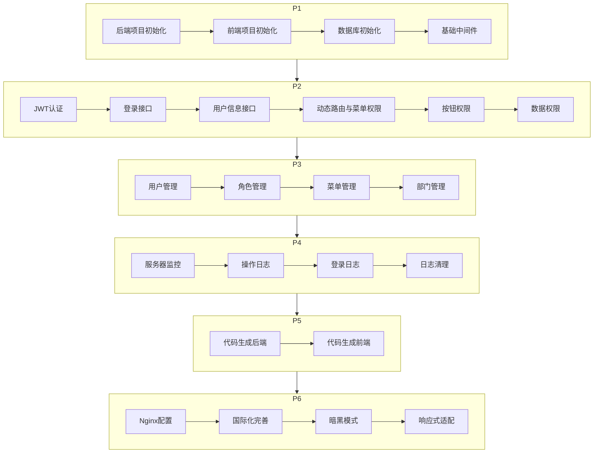

# 开发任务清单

## 开发顺序总览

---

## 阶段一：项目基础搭建

### 1.1 后端项目初始化 ✅
- [x] 初始化 Go module（`go mod init go-admin`）
- [x] 安装核心依赖（Gin, GORM, Viper, Zap, JWT, go-redis 等）
- [x] 创建目录结构（config, global, initialize, middleware, model, repository, service, controller, router, utils, sql, template）
- [x] 编写 `main.go` 入口文件（初始化顺序：Viper → Logger → DB → Redis → Router → 启动）

### 1.2 配置管理 ✅
- [x] 定义配置结构体 `config/config.go`（Server, Database, Redis, JWT, Log, Codegen）
- [x] 编写默认配置文件 `config/config.yaml`
- [x] 实现 Viper 初始化 `initialize/viper.go`（读取配置文件，支持环境变量覆盖）
- [x] 实现全局变量 `global/global.go`（DB, Redis, Log, Config）

### 1.3 日志系统 ✅
- [x] 实现 Zap 初始化 `initialize/logger.go`
- [x] 集成 lumberjack 实现日志按日期/大小切割
- [x] 配置日志输出到控制台 + 文件
- [x] 封装日志工具函数

### 1.4 数据库初始化 ✅
- [x] 实现数据库初始化 `initialize/db.go`（支持 SQLite，预留扩展接口）
- [x] 实现表前缀机制：GORM `TableName()` 方法自动拼接 `config.yaml` 中的 `table_prefix`
- [x] 编写建表 SQL 脚本 `sql/init.sql`（使用模板变量 `{{.TablePrefix}}` 动态生成表名）
- [x] 编写初始数据脚本 `sql/seed.sql`（管理员账号、默认角色、默认菜单、默认部门）
- [x] 实现数据库连接池配置
- [x] 实现 Redis 初始化 `initialize/redis.go`

### 1.5 基础工具与中间件 ✅
- [x] 实现 CORS 跨域中间件 `middleware/cors.go`
- [x] 实现统一响应工具 `utils/response.go`（Success, Fail, PageSuccess）
- [x] 实现分页工具 `utils/pagination.go`
- [x] 实现数据脱敏工具 `utils/desensitize.go`（手机号、邮箱、身份证脱敏函数）
- [x] 实现密码加密工具 `utils/bcrypt.go`（bcrypt 加密、校验）
- [x] 实现全局异常恢复中间件

### 1.6 前端项目初始化 ✅
- [x] 使用 Vite 创建 Vue3 + TypeScript 项目
- [x] 安装核心依赖（Element-Plus, TailwindCSS, Pinia, Axios, Vue Router, vue-i18n）
- [x] 配置 TailwindCSS
- [x] 配置 Element-Plus 按需引入
- [x] 配置路径别名（@ → src）
- [x] 配置环境变量文件（.env.development, .env.production）
- [x] 创建基础目录结构

### 1.7 前端基础框架 ✅
- [x] 封装 Axios 实例 `utils/request.ts`（基础配置、请求/响应拦截器）
- [x] 实现 Token 存取工具 `utils/auth.ts`
- [x] 创建 Pinia Store 结构（user, permission, app, tagsView）
- [x] 配置 Vue Router（静态路由：登录、404、403）
- [x] 实现路由守卫 `router/guard.ts`（未登录跳转登录页）
- [x] 创建基础布局组件骨架 `layout/`

---

## 阶段二：认证与权限系统

### 2.1 JWT 认证（后端） ✅
- [x] 实现 JWT 工具 `utils/jwt.go`（生成Token、解析Token、刷新Token）
- [x] 实现密码加密工具 `utils/bcrypt.go`（加密、校验）
- [x] 实现认证中间件 `middleware/auth.go`（解析Token、校验有效性、Token黑名单检查）
- [x] 编写认证相关 Model（LoginReq, TokenResp, UserInfoResp）
- [x] 编写认证 Repository（查询用户、验证密码）
- [x] 编写认证 Service（登录、登出、刷新Token、获取用户信息）
- [x] 编写认证 Controller（处理登录/登出/刷新/用户信息请求）
- [x] 编写认证 Router（注册路由）

### 2.2 登录页面（前端） ✅
- [x] 实现登录页 `views/login/index.vue`（用户名、密码、登录按钮）
- [x] 实现登录 API `api/auth.ts`
- [x] 实现 user Store（存储Token、用户信息）
- [x] 实现登录逻辑（调用API → 存储Token → 跳转首页）
- [x] 实现 Token 无感刷新（Axios 响应拦截器中处理 401）

### 2.3 用户信息与动态菜单 ✅
- [x] 实现获取用户信息接口 `GET /api/v1/user/info`
- [x] 实现获取用户菜单接口 `GET /api/v1/user/menus`
- [x] 前端实现 permission Store（存储菜单、按钮权限 + generateRoutes）
- [x] 前端实现动态路由生成（根据菜单数据 router.addRoute）
- [x] 前端实现侧边栏菜单渲染（递归组件 SidebarItem）

### 2.4 布局组件 ✅
- [x] 实现主布局 `layout/index.vue`（移动端遮罩层、响应式断点检测）
- [x] 实现侧边栏 `layout/components/Sidebar.vue`（可折叠、Logo、菜单渲染）
- [x] 实现顶部导航 `layout/components/Navbar.vue`（用户信息、语言切换、主题切换、全屏、国际化）
- [x] 实现标签页导航 `layout/components/TagsView.vue`（右键菜单、刷新、关闭、国际化）
- [x] 实现内容区 `layout/components/AppMain.vue`（路由切换动画、keep-alive缓存）
- [x] 实现面包屑 `components/Breadcrumb.vue`（国际化支持）
- [x] 创建响应式断点检测 Hook `hooks/useBreakpoint.ts`
- [x] 创建重定向组件 `views/redirect/index.vue`（标签页刷新功能）
- [x] 添加布局国际化文案 `i18n/zh-CN/modules/layout.ts` 和 `i18n/en/modules/layout.ts`

### 2.5 按钮权限 ✅
- [x] 后端实现权限校验中间件（根据接口匹配权限标识）
- [x] 前端实现 `v-permission` 自定义指令
- [x] 前端实现 `usePermission` 组合式函数

### 2.6 数据权限 ✅
- [x] 实现数据权限工具 `utils/data_scope.go`（根据 data_scope 构建查询条件）
- [x] 实现数据权限中间件 `middleware/data_scope.go`
- [x] 在 Repository 层集成数据权限过滤

---

## 阶段三：系统管理模块

### 3.1 用户管理 ✅
- [x] 后端：User Entity / Request / Response
- [x] 后端：UserRepository（CRUD + 分页查询 + 数据权限）
- [x] 后端：UserService（业务逻辑 + 角色关联）
- [x] 后端：UserController（RESTful 接口）
- [x] 后端：User Router
- [x] 前端：用户列表页 `views/system/user/index.vue`
- [x] 前端：用户表单组件 `views/system/user/components/UserForm.vue`
- [x] 前端：用户 API `api/system.ts`
- [x] 前端：用户模块国际化文案

### 3.2 角色管理 ✅
- [x] 后端：Role Entity / Request / Response
- [x] 后端：RoleRepository（CRUD + 菜单关联 + 部门关联）
- [x] 后端：RoleService（业务逻辑 + 权限分配）
- [x] 后端：RoleController
- [x] 后端：Role Router
- [x] 前端：角色列表页
- [x] 前端：角色表单组件（含菜单树选择、数据权限配置）
- [x] 前端：角色 API
- [x] 前端：角色模块国际化文案

### 3.3 菜单管理 ✅
- [x] 后端：Menu Entity / Request / Response
- [x] 后端：MenuRepository（CRUD + 树形查询）
- [x] 后端：MenuService
- [x] 后端：MenuController
- [x] 后端：Menu Router
- [x] 前端：菜单列表页（树形表格）
- [x] 前端：菜单表单组件
- [x] 前端：菜单 API
- [x] 前端：菜单模块国际化文案

### 3.4 部门管理 ✅
- [x] 后端：Dept Entity / Request / Response
- [x] 后端：DeptRepository（CRUD + 树形查询）
- [x] 后端：DeptService
- [x] 后端：DeptController
- [x] 后端：Dept Router
- [x] 前端：部门列表页（树形表格）
- [x] 前端：部门表单组件
- [x] 前端：部门 API
- [x] 前端：部门模块国际化文案

### 3.5 首页仪表盘 ✅
- [x] 前端：Dashboard 页面（欢迎信息、快捷入口、系统概况）
- [x] 后端：Dashboard 统计接口（用户数、角色数等）

---

## 阶段四：系统监控模块

### 4.1 服务器监控 ✅
- [x] 后端：使用 gopsutil 获取 CPU/内存/磁盘信息
- [x] 后端：获取 Go 运行时信息（goroutine、GC、内存分配）
- [x] 后端：检查数据库连接状态
- [x] 后端：检查 Redis 连接状态
- [x] 后端：MonitorController + Router
- [x] 前端：服务器监控页面（信息卡片展示）

### 4.2 操作日志 ✅
- [x] 后端：OperationLog Entity
- [x] 后端：操作日志中间件 `middleware/operation_log.go`（自动记录请求信息）
- [x] 后端：OperationLogRepository（分页查询 + 清空）
- [x] 后端：OperationLogService + Controller
- [x] 前端：操作日志列表页
- [x] 前端：操作日志 API

### 4.3 登录日志 ✅
- [x] 后端：LoginLog Entity
- [x] 后端：登录时自动记录日志
- [x] 后端：LoginLogRepository（分页查询 + 清空）
- [x] 后端：LoginLogService + Controller
- [x] 前端：登录日志列表页
- [x] 前端：登录日志 API

### 4.4 日志清理策略
- [ ] 后端：实现日志清理接口（按时间范围清理）
- [ ] 后端：可选 - 定时任务自动清理过期日志

---

## 阶段五：代码生成模块

### 5.1 代码生成后端 ✅
- [x] 实现数据库表信息查询（读取表名、字段名、字段类型等元数据）
- [x] 实现模板引擎初始化（text/template + sprig 函数）
- [x] 编写后端代码模板（model, request, response, repository, service, controller, router, sql）
- [x] 编写前端代码模板（api, list.vue, form.vue, i18n）
- [x] 实现代码生成 Service（模板渲染 + ZIP 打包）
- [x] 实现代码预览接口（返回渲染后的代码文本）
- [x] 实现代码生成接口（返回 ZIP 文件流）
- [x] 实现生成配置保存/读取接口
- [x] CodegenController + Router

### 5.2 代码生成前端 ✅
- [x] 代码生成配置页 `views/codegen/index.vue`
- [x] 表选择组件（展示数据库表列表）
- [x] 字段配置组件（可编辑表格，配置字段属性）
- [x] 基础信息配置表单
- [x] 代码预览组件（代码高亮 + Tab 切换文件）
- [x] 下载功能（触发 ZIP 下载）
- [x] 代码生成 API `api/codegen.ts`
- [x] 代码生成模块国际化文案

---

## 阶段六：部署与优化

### 6.1 国际化完善 ✅
- [x] 完善所有页面的中英文文案
- [x] 实现语言切换功能（顶部导航栏按钮）
- [x] 语言偏好持久化（localStorage）

### 6.2 白天/黑夜模式 ✅
- [x] 集成 Element-Plus 暗黑主题（`element-plus/theme-chalk/dark/css-vars.css`）
- [x] 创建主题工具 `utils/theme.ts`（getThemeMode, setThemeMode, toggleThemeMode, initTheme）
- [x] 实现主题切换功能（Navbar 月亮/太阳图标切换，登录页主题切换按钮）
- [x] 自定义清新简约风格颜色方案（`variables.css` - 白天/黑夜双套 CSS 变量）
- [x] Tailwind CSS dark 模式配置为 class 策略（`@custom-variant dark`）
- [x] 全局样式适配暗黑模式（`index.css` - 滚动条、el-card、el-table、el-dialog 等）
- [x] 布局组件适配（Layout、Sidebar、Navbar、TagsView、AppMain、Breadcrumb）
- [x] 页面组件适配（Dashboard、Login、404、403）
- [x] 主题偏好持久化（localStorage 存储，默认白天模式）
- [x] 防止主题闪烁（`index.html` 内联脚本提前读取主题）
- [x] 国际化文案（darkMode / lightMode 中英文）

### 6.3 响应式适配 ✅
- [x] 移动端侧边栏遮罩弹出（`layout/index.vue` - 遮罩层 + 淡入淡出动画 + backdrop-filter）
- [x] 平板端侧边栏图标模式（`layout/components/Sidebar.vue` - 自动折叠为图标模式）
- [x] 表格/表单响应式布局（`assets/styles/index.css` - 移动端/平板端全局响应式样式）
- [x] 断点检测 Hook（`hooks/useBreakpoint.ts` - xs/sm/md/lg/xl/xxl 断点 + 设备类型检测）
- [x] 修复 PC 端菜单目录图标显示（`utils/icon.ts` - 图标名称映射 + `SidebarItem.vue` 集成）
- [x] Navbar 响应式适配（移动端隐藏用户名、平板端限制宽度）
- [x] TagsView 响应式适配（移动端缩小标签尺寸）

### 6.4 Ngingongk
- [ ] 编写 Nginx 配置文件（前端静态文件 + API 反向代理）
- [ ] 编写前端构建脚本
- [ ] 编写后端编译脚本
- [ ] 编写部署文档

### 6.5 其他优化
- [ ] 请求限流中间件
- [ ] 前端路由懒加载
- [ ] 前端打包优化（分包策略）
- [ ] 后端接口性能优化

---

## 开发优先级说明

| 优先级 | 阶段 | 说明 |
|--------|------|------|
| P0 | 阶段一 | 基础框架，所有功能的前提 |
| P0 | 阶段二 | 核心认证权限，系统可用的基础 |
| P1 | 阶段三 | 核心业务功能 |
| P2 | 阶段四 | 辅助运维功能 |
| P2 | 阶段五 | 效率工具 |
| P3 | 阶段六 | 体验优化和部署 |

**建议开发顺序：** 严格按阶段顺序开发，每个阶段内可并行开发前后端。
