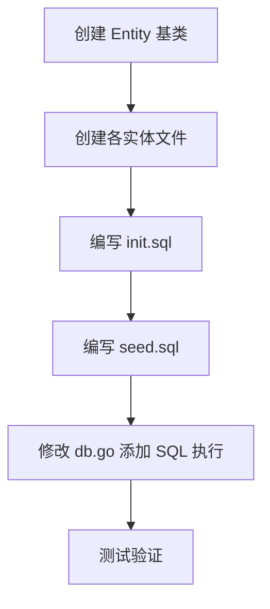

# 1.4 数据库初始化 - 未完成任务实现计划

## 当前状态

| 任务 | 状态 | 说明 |
|------|------|------|
| 实现数据库初始化 `initialize/db.go` | ✅ 已完成 | 支持 SQLite，预留扩展接口 |
| 实现表前缀机制 | ❌ 待实现 | 需要创建 Entity 基类和 `TableName()` 方法 |
| 编写建表 SQL 脚本 `sql/init.sql` | ❌ 待实现 | 需要创建 SQL 脚本 |
| 编写初始数据脚本 `sql/seed.sql` | ❌ 待实现 | 需要创建种子数据脚本 |
| 实现数据库连接池配置 | ✅ 已完成 | MaxIdleConns=10, MaxOpenConns=100 |
| 实现 Redis 初始化 `initialize/redis.go` | ✅ 已完成 | 已实现连接和 Ping 测试 |

---

## 任务 1：实现表前缀机制

### 目标
创建 Entity 基类，所有实体继承该基类，通过 `TableName()` 方法自动拼接配置中的 `table_prefix`。

### 实现方案

#### 1.1 创建 Entity 基类 `model/entity/base.go`

```go
package entity

import (
    "go-admin/global"
    "time"
)

// BaseEntity 实体基类，所有实体继承
type BaseEntity struct {
    ID        uint       `gorm:"primarykey" json:"id"`
    CreatedAt time.Time  `json:"created_at"`
    UpdatedAt time.Time  `json:"updated_at"`
    DeletedAt *time.Time `gorm:"index" json:"deleted_at,omitempty"`
}

// TableName 返回带前缀的表名
// 子结构体需要重写此方法，传入不带前缀的表名
func TableName(name string) string {
    prefix := global.Config.TablePrefix
    return prefix + name
}
```

#### 1.2 创建各实体并实现 `TableName()` 方法

**文件结构：**
```
model/entity/
├── base.go          # 基类
├── user.go          # 用户实体
├── role.go          # 角色实体
├── menu.go          # 菜单实体
├── dept.go          # 部门实体
├── user_role.go     # 用户角色关联
├── role_menu.go     # 角色菜单关联
├── role_dept.go     # 角色部门关联
├── operation_log.go # 操作日志
└── login_log.go     # 登录日志
```

**示例：`model/entity/user.go`**

```go
package entity

// User 用户实体
type User struct {
    BaseEntity
    Username string `gorm:"size:64;not null;uniqueIndex" json:"username"`
    Password string `gorm:"size:128;not null" json:"-"` // API 响应中不返回
    Nickname string `gorm:"size:64" json:"nickname"`
    Email    string `gorm:"size:128" json:"email"`
    Phone    string `gorm:"size:20" json:"phone"`
    Status   int    `gorm:"default:1" json:"status"` // 0=禁用 1=正常
    DeptID   uint   `gorm:"index" json:"dept_id"`
    Avatar   string `gorm:"size:256" json:"avatar"`
    Remark   string `gorm:"size:512" json:"remark"`
}

// TableName 返回带前缀的表名
func (User) TableName() string {
    return TableName("user")
}
```

**其他实体类似实现，表名对应关系：**

| 实体 | 表名（不含前缀） |
|------|------------------|
| User | user |
| Role | role |
| Menu | menu |
| Dept | dept |
| UserRole | user_role |
| RoleMenu | role_menu |
| RoleDept | role_dept |
| OperationLog | operation_log |
| LoginLog | login_log |

---

## 任务 2：编写建表 SQL 脚本

### 目标
创建 `sql/init.sql`，使用 Go 模板语法动态生成带前缀的表名。

### 实现方案

**文件：`sql/init.sql`**

```sql
-- go-admin 建表脚本
-- 使用 Go text/template 渲染，变量 {{.TablePrefix}} 来自 config.yaml

-- 用户表
CREATE TABLE IF NOT EXISTS {{.TablePrefix}}user (
    id INTEGER PRIMARY KEY AUTOINCREMENT,
    username VARCHAR(64) NOT NULL,
    password VARCHAR(128) NOT NULL,
    nickname VARCHAR(64),
    email VARCHAR(128),
    phone VARCHAR(20),
    status INTEGER DEFAULT 1,
    dept_id INTEGER,
    avatar VARCHAR(256),
    remark VARCHAR(512),
    created_at DATETIME DEFAULT CURRENT_TIMESTAMP,
    updated_at DATETIME DEFAULT CURRENT_TIMESTAMP,
    deleted_at DATETIME
);
CREATE UNIQUE INDEX IF NOT EXISTS idx_user_username ON {{.TablePrefix}}user(username);
CREATE INDEX IF NOT EXISTS idx_user_dept_id ON {{.TablePrefix}}user(dept_id);

-- 角色表
CREATE TABLE IF NOT EXISTS {{.TablePrefix}}role (
    id INTEGER PRIMARY KEY AUTOINCREMENT,
    name VARCHAR(64) NOT NULL,
    code VARCHAR(64) NOT NULL,
    data_scope INTEGER DEFAULT 1,
    sort INTEGER DEFAULT 0,
    status INTEGER DEFAULT 1,
    remark VARCHAR(512),
    created_at DATETIME DEFAULT CURRENT_TIMESTAMP,
    updated_at DATETIME DEFAULT CURRENT_TIMESTAMP,
    deleted_at DATETIME
);
CREATE UNIQUE INDEX IF NOT EXISTS idx_role_code ON {{.TablePrefix}}role(code);

-- 菜单表
CREATE TABLE IF NOT EXISTS {{.TablePrefix}}menu (
    id INTEGER PRIMARY KEY AUTOINCREMENT,
    parent_id INTEGER DEFAULT 0,
    name VARCHAR(64) NOT NULL,
    path VARCHAR(128),
    component VARCHAR(128),
    icon VARCHAR(64),
    type INTEGER,
    sort INTEGER DEFAULT 0,
    visible INTEGER DEFAULT 1,
    status INTEGER DEFAULT 1,
    perms VARCHAR(128),
    created_at DATETIME DEFAULT CURRENT_TIMESTAMP,
    updated_at DATETIME DEFAULT CURRENT_TIMESTAMP,
    deleted_at DATETIME
);

-- 部门表
CREATE TABLE IF NOT EXISTS {{.TablePrefix}}dept (
    id INTEGER PRIMARY KEY AUTOINCREMENT,
    parent_id INTEGER DEFAULT 0,
    name VARCHAR(64) NOT NULL,
    sort INTEGER DEFAULT 0,
    status INTEGER DEFAULT 1,
    leader VARCHAR(64),
    phone VARCHAR(20),
    email VARCHAR(128),
    created_at DATETIME DEFAULT CURRENT_TIMESTAMP,
    updated_at DATETIME DEFAULT CURRENT_TIMESTAMP,
    deleted_at DATETIME
);

-- 用户角色关联表
CREATE TABLE IF NOT EXISTS {{.TablePrefix}}user_role (
    id INTEGER PRIMARY KEY AUTOINCREMENT,
    user_id INTEGER NOT NULL,
    role_id INTEGER NOT NULL
);
CREATE UNIQUE INDEX IF NOT EXISTS idx_user_role ON {{.TablePrefix}}user_role(user_id, role_id);

-- 角色菜单关联表
CREATE TABLE IF NOT EXISTS {{.TablePrefix}}role_menu (
    id INTEGER PRIMARY KEY AUTOINCREMENT,
    role_id INTEGER NOT NULL,
    menu_id INTEGER NOT NULL
);
CREATE UNIQUE INDEX IF NOT EXISTS idx_role_menu ON {{.TablePrefix}}role_menu(role_id, menu_id);

-- 角色部门关联表
CREATE TABLE IF NOT EXISTS {{.TablePrefix}}role_dept (
    id INTEGER PRIMARY KEY AUTOINCREMENT,
    role_id INTEGER NOT NULL,
    dept_id INTEGER NOT NULL
);
CREATE UNIQUE INDEX IF NOT EXISTS idx_role_dept ON {{.TablePrefix}}role_dept(role_id, dept_id);

-- 操作日志表
CREATE TABLE IF NOT EXISTS {{.TablePrefix}}operation_log (
    id INTEGER PRIMARY KEY AUTOINCREMENT,
    module VARCHAR(64),
    action VARCHAR(64),
    method VARCHAR(10),
    url VARCHAR(256),
    ip VARCHAR(64),
    operator VARCHAR(64),
    request_param TEXT,
    response_data TEXT,
    status INTEGER,
    error_msg VARCHAR(512),
    duration INTEGER,
    created_at DATETIME DEFAULT CURRENT_TIMESTAMP
);
CREATE INDEX IF NOT EXISTS idx_oplog_created_at ON {{.TablePrefix}}operation_log(created_at);
CREATE INDEX IF NOT EXISTS idx_oplog_operator ON {{.TablePrefix}}operation_log(operator);

-- 登录日志表
CREATE TABLE IF NOT EXISTS {{.TablePrefix}}login_log (
    id INTEGER PRIMARY KEY AUTOINCREMENT,
    username VARCHAR(64),
    ip VARCHAR(64),
    location VARCHAR(128),
    browser VARCHAR(64),
    os VARCHAR(64),
    status INTEGER,
    msg VARCHAR(256),
    created_at DATETIME DEFAULT CURRENT_TIMESTAMP
);
CREATE INDEX IF NOT EXISTS idx_loginlog_created_at ON {{.TablePrefix}}login_log(created_at);
CREATE INDEX IF NOT EXISTS idx_loginlog_username ON {{.TablePrefix}}login_log(username);
```

---

## 任务 3：编写初始数据脚本

### 目标
创建 `sql/seed.sql`，插入默认管理员、角色、菜单、部门数据。

### 实现方案

**文件：`sql/seed.sql`**

```sql
-- go-admin 初始数据脚本
-- 管理员密码：admin123（bcrypt 加密）

-- 默认部门
INSERT OR IGNORE INTO {{.TablePrefix}}dept (id, parent_id, name, sort, status) VALUES (1, 0, '总公司', 0, 1);
INSERT OR IGNORE INTO {{.TablePrefix}}dept (id, parent_id, name, sort, status) VALUES (2, 1, '默认部门', 0, 1);

-- 默认角色
INSERT OR IGNORE INTO {{.TablePrefix}}role (id, name, code, data_scope, sort, status, remark) VALUES (1, '超级管理员', 'admin', 1, 0, 1, '拥有所有权限');
INSERT OR IGNORE INTO {{.TablePrefix}}role (id, name, code, data_scope, sort, status, remark) VALUES (2, '普通用户', 'user', 4, 1, 1, '仅本人数据');

-- 默认管理员（密码：admin123）
INSERT OR IGNORE INTO {{.TablePrefix}}user (id, username, password, nickname, status, dept_id) 
VALUES (1, 'admin', '$2a$10$7JB720yubVSZvUI0rEqK/.VqGOZTH.ulu33dHOiBE8ByOhJIrdAu2', '超级管理员', 1, 1);

-- 管理员角色关联
INSERT OR IGNORE INTO {{.TablePrefix}}user_role (user_id, role_id) VALUES (1, 1);

-- 默认菜单
-- 系统管理目录
INSERT OR IGNORE INTO {{.TablePrefix}}menu (id, parent_id, name, path, component, icon, type, sort, visible, status, perms) VALUES (1, 0, '系统管理', '/system', '', 'setting', 0, 1, 1, 1, '');

-- 用户管理菜单
INSERT OR IGNORE INTO {{.TablePrefix}}menu (id, parent_id, name, path, component, icon, type, sort, visible, status, perms) VALUES (2, 1, '用户管理', 'user', 'system/user/index', 'user', 1, 1, 1, 1, '');
INSERT OR IGNORE INTO {{.TablePrefix}}menu (id, parent_id, name, path, component, icon, type, sort, visible, status, perms) VALUES (3, 2, '用户查询', '', '', '', 2, 0, 1, 1, 'system:user:list');
INSERT OR IGNORE INTO {{.TablePrefix}}menu (id, parent_id, name, path, component, icon, type, sort, visible, status, perms) VALUES (4, 2, '用户新增', '', '', '', 2, 0, 1, 1, 'system:user:add');
INSERT OR IGNORE INTO {{.TablePrefix}}menu (id, parent_id, name, path, component, icon, type, sort, visible, status, perms) VALUES (5, 2, '用户修改', '', '', '', 2, 0, 1, 1, 'system:user:edit');
INSERT OR IGNORE INTO {{.TablePrefix}}menu (id, parent_id, name, path, component, icon, type, sort, visible, status, perms) VALUES (6, 2, '用户删除', '', '', '', 2, 0, 1, 1, 'system:user:delete');

-- 角色管理菜单
INSERT OR IGNORE INTO {{.TablePrefix}}menu (id, parent_id, name, path, component, icon, type, sort, visible, status, perms) VALUES (7, 1, '角色管理', 'role', 'system/role/index', 'peoples', 1, 2, 1, 1, '');
INSERT OR IGNORE INTO {{.TablePrefix}}menu (id, parent_id, name, path, component, icon, type, sort, visible, status, perms) VALUES (8, 7, '角色查询', '', '', '', 2, 0, 1, 1, 'system:role:list');
INSERT OR IGNORE INTO {{.TablePrefix}}menu (id, parent_id, name, path, component, icon, type, sort, visible, status, perms) VALUES (9, 7, '角色新增', '', '', '', 2, 0, 1, 1, 'system:role:add');
INSERT OR IGNORE INTO {{.TablePrefix}}menu (id, parent_id, name, path, component, icon, type, sort, visible, status, perms) VALUES (10, 7, '角色修改', '', '', '', 2, 0, 1, 1, 'system:role:edit');
INSERT OR IGNORE INTO {{.TablePrefix}}menu (id, parent_id, name, path, component, icon, type, sort, visible, status, perms) VALUES (11, 7, '角色删除', '', '', '', 2, 0, 1, 1, 'system:role:delete');

-- 菜单管理菜单
INSERT OR IGNORE INTO {{.TablePrefix}}menu (id, parent_id, name, path, component, icon, type, sort, visible, status, perms) VALUES (12, 1, '菜单管理', 'menu', 'system/menu/index', 'tree-table', 1, 3, 1, 1, '');
INSERT OR IGNORE INTO {{.TablePrefix}}menu (id, parent_id, name, path, component, icon, type, sort, visible, status, perms) VALUES (13, 12, '菜单查询', '', '', '', 2, 0, 1, 1, 'system:menu:list');
INSERT OR IGNORE INTO {{.TablePrefix}}menu (id, parent_id, name, path, component, icon, type, sort, visible, status, perms) VALUES (14, 12, '菜单新增', '', '', '', 2, 0, 1, 1, 'system:menu:add');
INSERT OR IGNORE INTO {{.TablePrefix}}menu (id, parent_id, name, path, component, icon, type, sort, visible, status, perms) VALUES (15, 12, '菜单修改', '', '', '', 2, 0, 1, 1, 'system:menu:edit');
INSERT OR IGNORE INTO {{.TablePrefix}}menu (id, parent_id, name, path, component, icon, type, sort, visible, status, perms) VALUES (16, 12, '菜单删除', '', '', '', 2, 0, 1, 1, 'system:menu:delete');

-- 部门管理菜单
INSERT OR IGNORE INTO {{.TablePrefix}}menu (id, parent_id, name, path, component, icon, type, sort, visible, status, perms) VALUES (17, 1, '部门管理', 'dept', 'system/dept/index', 'tree', 1, 4, 1, 1, '');
INSERT OR IGNORE INTO {{.TablePrefix}}menu (id, parent_id, name, path, component, icon, type, sort, visible, status, perms) VALUES (18, 17, '部门查询', '', '', '', 2, 0, 1, 1, 'system:dept:list');
INSERT OR IGNORE INTO {{.TablePrefix}}menu (id, parent_id, name, path, component, icon, type, sort, visible, status, perms) VALUES (19, 17, '部门新增', '', '', '', 2, 0, 1, 1, 'system:dept:add');
INSERT OR IGNORE INTO {{.TablePrefix}}menu (id, parent_id, name, path, component, icon, type, sort, visible, status, perms) VALUES (20, 17, '部门修改', '', '', '', 2, 0, 1, 1, 'system:dept:edit');
INSERT OR IGNORE INTO {{.TablePrefix}}menu (id, parent_id, name, path, component, icon, type, sort, visible, status, perms) VALUES (21, 17, '部门删除', '', '', '', 2, 0, 1, 1, 'system:dept:delete');

-- 系统监控目录
INSERT OR IGNORE INTO {{.TablePrefix}}menu (id, parent_id, name, path, component, icon, type, sort, visible, status, perms) VALUES (22, 0, '系统监控', '/monitor', '', 'monitor', 0, 2, 1, 1, '');
INSERT OR IGNORE INTO {{.TablePrefix}}menu (id, parent_id, name, path, component, icon, type, sort, visible, status, perms) VALUES (23, 22, '服务器监控', 'server', 'monitor/server/index', 'server', 1, 1, 1, 1, '');
INSERT OR IGNORE INTO {{.TablePrefix}}menu (id, parent_id, name, path, component, icon, type, sort, visible, status, perms) VALUES (24, 22, '操作日志', 'operation-log', 'monitor/operation-log/index', 'form', 1, 2, 1, 1, '');
INSERT OR IGNORE INTO {{.TablePrefix}}menu (id, parent_id, name, path, component, icon, type, sort, visible, status, perms) VALUES (25, 22, '登录日志', 'login-log', 'monitor/login-log/index', 'logininfor', 1, 3, 1, 1, '');

-- 代码生成目录
INSERT OR IGNORE INTO {{.TablePrefix}}menu (id, parent_id, name, path, component, icon, type, sort, visible, status, perms) VALUES (26, 0, '代码生成', '/codegen', '', 'code', 0, 3, 1, 1, '');
INSERT OR IGNORE INTO {{.TablePrefix}}menu (id, parent_id, name, path, component, icon, type, sort, visible, status, perms) VALUES (27, 26, '代码生成', 'index', 'codegen/index', 'guide', 1, 1, 1, 1, '');

-- 超级管理员角色拥有所有菜单权限
INSERT OR IGNORE INTO {{.TablePrefix}}role_menu (role_id, menu_id) VALUES (1, 1);
INSERT OR IGNORE INTO {{.TablePrefix}}role_menu (role_id, menu_id) VALUES (1, 2);
INSERT OR IGNORE INTO {{.TablePrefix}}role_menu (role_id, menu_id) VALUES (1, 3);
INSERT OR IGNORE INTO {{.TablePrefix}}role_menu (role_id, menu_id) VALUES (1, 4);
INSERT OR IGNORE INTO {{.TablePrefix}}role_menu (role_id, menu_id) VALUES (1, 5);
INSERT OR IGNORE INTO {{.TablePrefix}}role_menu (role_id, menu_id) VALUES (1, 6);
INSERT OR IGNORE INTO {{.TablePrefix}}role_menu (role_id, menu_id) VALUES (1, 7);
INSERT OR IGNORE INTO {{.TablePrefix}}role_menu (role_id, menu_id) VALUES (1, 8);
INSERT OR IGNORE INTO {{.TablePrefix}}role_menu (role_id, menu_id) VALUES (1, 9);
INSERT OR IGNORE INTO {{.TablePrefix}}role_menu (role_id, menu_id) VALUES (1, 10);
INSERT OR IGNORE INTO {{.TablePrefix}}role_menu (role_id, menu_id) VALUES (1, 11);
INSERT OR IGNORE INTO {{.TablePrefix}}role_menu (role_id, menu_id) VALUES (1, 12);
INSERT OR IGNORE INTO {{.TablePrefix}}role_menu (role_id, menu_id) VALUES (1, 13);
INSERT OR IGNORE INTO {{.TablePrefix}}role_menu (role_id, menu_id) VALUES (1, 14);
INSERT OR IGNORE INTO {{.TablePrefix}}role_menu (role_id, menu_id) VALUES (1, 15);
INSERT OR IGNORE INTO {{.TablePrefix}}role_menu (role_id, menu_id) VALUES (1, 16);
INSERT OR IGNORE INTO {{.TablePrefix}}role_menu (role_id, menu_id) VALUES (1, 17);
INSERT OR IGNORE INTO {{.TablePrefix}}role_menu (role_id, menu_id) VALUES (1, 18);
INSERT OR IGNORE INTO {{.TablePrefix}}role_menu (role_id, menu_id) VALUES (1, 19);
INSERT OR IGNORE INTO {{.TablePrefix}}role_menu (role_id, menu_id) VALUES (1, 20);
INSERT OR IGNORE INTO {{.TablePrefix}}role_menu (role_id, menu_id) VALUES (1, 21);
INSERT OR IGNORE INTO {{.TablePrefix}}role_menu (role_id, menu_id) VALUES (1, 22);
INSERT OR IGNORE INTO {{.TablePrefix}}role_menu (role_id, menu_id) VALUES (1, 23);
INSERT OR IGNORE INTO {{.TablePrefix}}role_menu (role_id, menu_id) VALUES (1, 24);
INSERT OR IGNORE INTO {{.TablePrefix}}role_menu (role_id, menu_id) VALUES (1, 25);
INSERT OR IGNORE INTO {{.TablePrefix}}role_menu (role_id, menu_id) VALUES (1, 26);
INSERT OR IGNORE INTO {{.TablePrefix}}role_menu (role_id, menu_id) VALUES (1, 27);

-- 超级管理员拥有所有部门权限
INSERT OR IGNORE INTO {{.TablePrefix}}role_dept (role_id, dept_id) VALUES (1, 1);
INSERT OR IGNORE INTO {{.TablePrefix}}role_dept (role_id, dept_id) VALUES (1, 2);
```

---

## 任务 4：实现 SQL 脚本执行

### 目标
在数据库初始化时自动执行建表和种子数据脚本。

### 实现方案

**修改 `initialize/db.go`，添加 SQL 脚本执行逻辑：**

```go
// InitSQL 执行建表和种子数据脚本
func InitSQL(db *gorm.DB) error {
    // 读取并执行 init.sql
    initSQL, err := os.ReadFile("sql/init.sql")
    if err != nil {
        return fmt.Errorf("读取 init.sql 失败: %v", err)
    }
    
    // 渲染模板
    tmpl, err := template.New("init").Parse(string(initSQL))
    if err != nil {
        return fmt.Errorf("解析 init.sql 模板失败: %v", err)
    }
    
    var buf bytes.Buffer
    err = tmpl.Execute(&buf, map[string]string{
        "TablePrefix": global.Config.TablePrefix,
    })
    if err != nil {
        return fmt.Errorf("渲染 init.sql 模板失败: %v", err)
    }
    
    // 执行 SQL
    err = db.Exec(buf.String()).Error
    if err != nil {
        return fmt.Errorf("执行 init.sql 失败: %v", err)
    }
    
    // 类似方式执行 seed.sql
    // ...
    
    return nil
}
```

---

## 实现顺序



## 文件清单

| 文件路径 | 操作 | 说明 |
|----------|------|------|
| `server/model/entity/base.go` | 新建 | Entity 基类 |
| `server/model/entity/user.go` | 新建 | 用户实体 |
| `server/model/entity/role.go` | 新建 | 角色实体 |
| `server/model/entity/menu.go` | 新建 | 菜单实体 |
| `server/model/entity/dept.go` | 新建 | 部门实体 |
| `server/model/entity/user_role.go` | 新建 | 用户角色关联 |
| `server/model/entity/role_menu.go` | 新建 | 角色菜单关联 |
| `server/model/entity/role_dept.go` | 新建 | 角色部门关联 |
| `server/model/entity/operation_log.go` | 新建 | 操作日志实体 |
| `server/model/entity/login_log.go` | 新建 | 登录日志实体 |
| `server/sql/init.sql` | 新建 | 建表脚本 |
| `server/sql/seed.sql` | 新建 | 种子数据脚本 |
| `server/initialize/db.go` | 修改 | 添加 SQL 脚本执行逻辑 |
