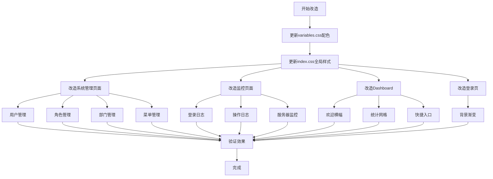

# 前端UI扁平化改造方案

## 一、改造目标

1. **扁平化布局**：减少卡片嵌套，采用模块化分层设计
2. **明亮清新主题**：以明亮、清新、现代的配色为主，避免暗沉颜色

## 二、当前问题分析

### 2.1 卡片嵌套问题

| 页面 | 当前结构 | 问题 |
|------|----------|------|
| 用户管理 | 搜索卡片 + 表格卡片 | 两层卡片上下堆叠 |
| 角色管理 | 搜索卡片 + 表格卡片 | 两层卡片上下堆叠 |
| 登录日志 | 搜索卡片 + 表格卡片 | 两层卡片上下堆叠 |
| 操作日志 | 搜索卡片 + 表格卡片 | 两层卡片上下堆叠 |
| Dashboard | 欢迎卡片 + 统计卡片×6 + 快捷入口卡片 + 活动卡片 + 系统信息卡片 | 卡片过多 |
| 服务器监控 | Tailwind圆角div | 风格不统一 |

### 2.2 颜色偏暗问题

- 侧边栏：`#1e293b`（深蓝黑）
- 登录页/欢迎卡片：紫色渐变 `#667eea → #764ba2`（偏暗紫）
- 暗黑模式：`#14141f`（深紫黑）

## 三、扁平化设计规范

### 3.1 页面结构规范

**标准列表页面结构：**
```
┌─────────────────────────────────────┐
│  搜索区域（无卡片，使用背景色区分）    │
│  ┌─────────────────────────────────┐│
│  │  表单控件                       ││
│  └─────────────────────────────────┘│
├─────────────────────────────────────┤
│  表格区域（单层卡片）                │
│  ┌─────────────────────────────────┐│
│  │  操作按钮栏                     ││
│  │  ─────────────────────────────  ││
│  │  数据表格                       ││
│  │  ─────────────────────────────  ││
│  │  分页                           ││
│  └─────────────────────────────────┘│
└─────────────────────────────────────┘
```

**Dashboard页面结构：**
```
┌─────────────────────────────────────┐
│  欢迎横幅（渐变背景，非卡片）        │
├─────────────────────────────────────┤
│  统计数据（网格布局，轻量卡片）      │
├─────────────────────────────────────┤
│  快捷入口 + 最近活动（并排，无卡片） │
├─────────────────────────────────────┤
│  系统信息（单层卡片）                │
└─────────────────────────────────────┘
```

### 3.2 扁平化实现方式

1. **搜索区域**：去掉 `el-card`，改用 `div` + 背景色 + 底部边框分隔
2. **表格区域**：保留单层 `el-card`，将操作按钮整合到卡片头部
3. **Dashboard**：欢迎区域用横幅，统计用轻量卡片，快捷入口用纯div
4. **服务器监控**：统一使用 `el-card` 替代 Tailwind div

## 四、明亮清新配色方案

### 4.1 白天模式配色

```css
:root {
  /* 主色调 - 清新蓝（更明亮） */
  --el-color-primary: #4096ff;
  --el-color-primary-light-3: #85b8ff;
  --el-color-primary-light-5: #a8d0ff;
  --el-color-primary-light-7: #cce5ff;
  --el-color-primary-light-8: #dceaff;
  --el-color-primary-light-9: #eef5ff;
  --el-color-primary-dark-2: #2b7de9;

  /* 成功色 - 清新绿 */
  --el-color-success: #52c41a;
  --el-color-success-light-3: #95de64;
  --el-color-success-light-5: #b7eb8f;
  --el-color-success-light-7: #d9f7be;
  --el-color-success-light-8: #e6ffcc;
  --el-color-success-light-9: #f0ffe6;
  --el-color-success-dark-2: #389e0d;

  /* 警告色 - 温暖橙 */
  --el-color-warning: #faad14;
  --el-color-warning-light-3: #ffc53d;
  --el-color-warning-light-5: #ffd666;
  --el-color-warning-light-7: #ffe58f;
  --el-color-warning-light-8: #fff1b8;
  --el-color-warning-light-9: #fffbe6;
  --el-color-warning-dark-2: #d48806;

  /* 危险色 - 柔和红 */
  --el-color-danger: #ff4d4f;
  --el-color-danger-light-3: #ff7875;
  --el-color-danger-light-5: #ffa39e;
  --el-color-danger-light-7: #ffccc7;
  --el-color-danger-light-8: #ffd8d8;
  --el-color-danger-light-9: #fff1f0;
  --el-color-danger-dark-2: #cf1322;

  /* 信息色 - 中性灰 */
  --el-color-info: #8c8c8c;
  --el-color-info-light-3: #bfbfbf;
  --el-color-info-light-5: #d9d9d9;
  --el-color-info-light-7: #e8e8e8;
  --el-color-info-light-8: #f0f0f0;
  --el-color-info-light-9: #f5f5f5;
  --el-color-info-dark-2: #595959;

  /* 背景色 - 纯净白 */
  --el-bg-color: #ffffff;
  --el-bg-color-page: #f5f7fa;
  --el-bg-color-overlay: #ffffff;

  /* 文字色 - 清晰层次 */
  --el-text-color-primary: #1f1f1f;
  --el-text-color-regular: #434343;
  --el-text-color-secondary: #8c8c8c;
  --el-text-color-placeholder: #bfbfbf;
  --el-text-color-disabled: #d9d9d9;

  /* 边框色 - 轻柔 */
  --el-border-color: #e8e8e8;
  --el-border-color-light: #f0f0f0;
  --el-border-color-lighter: #f5f5f5;
  --el-border-color-extra-light: #fafafa;
  --el-border-color-dark: #d9d9d9;

  /* 填充色 - 清新 */
  --el-fill-color: #f5f5f5;
  --el-fill-color-light: #fafafa;
  --el-fill-color-lighter: #fafafa;
  --el-fill-color-extra-light: #fafafa;
  --el-fill-color-dark: #e8e8e8;
  --el-fill-color-blank: #ffffff;

  /* 阴影 - 轻盈 */
  --el-box-shadow: 0 1px 2px 0 rgba(0, 0, 0, 0.03), 0 1px 6px -1px rgba(0, 0, 0, 0.02), 0 2px 4px 0 rgba(0, 0, 0, 0.02);
  --el-box-shadow-light: 0 1px 2px 0 rgba(0, 0, 0, 0.03);
  --el-box-shadow-lighter: 0 0 12px rgba(0, 0, 0, 0.03);
  --el-box-shadow-dark: 0 4px 8px 0 rgba(0, 0, 0, 0.06), 0 2px 4px -1px rgba(0, 0, 0, 0.04);

  /* 侧边栏配色 - 清新蓝白 */
  --sidebar-bg: #ffffff;
  --sidebar-text: #434343;
  --sidebar-active-text: #4096ff;
  --sidebar-hover-bg: rgba(64, 150, 255, 0.06);
  --sidebar-active-bg: rgba(64, 150, 255, 0.1);
  --sidebar-width: 210px;
  --sidebar-collapsed-width: 64px;

  /* 顶部导航 */
  --navbar-height: 50px;
  --tagsview-height: 34px;

  /* 内容区背景 */
  --content-bg: #f5f7fa;
  --card-bg: #ffffff;
  --card-shadow: 0 1px 2px 0 rgba(0, 0, 0, 0.03), 0 1px 6px -1px rgba(0, 0, 0, 0.02);
}
```

### 4.2 暗黑模式配色

```css
html.dark {
  /* 主色调 - 明亮蓝 */
  --el-color-primary: #4096ff;
  --el-color-primary-light-3: #85b8ff;
  --el-color-primary-light-5: #a8d0ff;
  --el-color-primary-light-7: #cce5ff;
  --el-color-primary-light-8: #dceaff;
  --el-color-primary-light-9: #eef5ff;
  --el-color-primary-dark-2: #2b7de9;

  /* 成功色 */
  --el-color-success: #73d13d;
  --el-color-success-dark-2: #52c41a;

  /* 警告色 */
  --el-color-warning: #ffc53d;
  --el-color-warning-dark-2: #faad14;

  /* 危险色 */
  --el-color-danger: #ff7875;
  --el-color-danger-dark-2: #ff4d4f;

  /* 信息色 */
  --el-color-info: #8c8c8c;
  --el-color-info-dark-2: #595959;

  /* 背景色 - 深灰（非深紫） */
  --el-bg-color: #1f1f1f;
  --el-bg-color-page: #141414;
  --el-bg-color-overlay: #262626;

  /* 文字色 */
  --el-text-color-primary: #ffffffd9;
  --el-text-color-regular: #ffffffa6;
  --el-text-color-secondary: #ffffff73;
  --el-text-color-placeholder: #ffffff40;
  --el-text-color-disabled: #ffffff26;

  /* 边框色 */
  --el-border-color: #424242;
  --el-border-color-light: #383838;
  --el-border-color-lighter: #303030;
  --el-border-color-extra-light: #262626;
  --el-border-color-dark: #505050;

  /* 填充色 */
  --el-fill-color: #262626;
  --el-fill-color-light: #1f1f1f;
  --el-fill-color-lighter: #1f1f1f;
  --el-fill-color-extra-light: #1f1f1f;
  --el-fill-color-dark: #303030;
  --el-fill-color-blank: #1f1f1f;

  /* 阴影 */
  --el-box-shadow: 0 1px 2px 0 rgba(0, 0, 0, 0.3), 0 1px 6px -1px rgba(0, 0, 0, 0.2);
  --el-box-shadow-light: 0 1px 2px 0 rgba(0, 0, 0, 0.3);
  --el-box-shadow-lighter: 0 0 12px rgba(0, 0, 0, 0.2);
  --el-box-shadow-dark: 0 4px 8px 0 rgba(0, 0, 0, 0.4);

  /* 侧边栏配色 - 深灰 */
  --sidebar-bg: #141414;
  --sidebar-text: #ffffffa6;
  --sidebar-active-text: #4096ff;
  --sidebar-hover-bg: rgba(64, 150, 255, 0.08);
  --sidebar-active-bg: rgba(64, 150, 255, 0.12);

  /* 内容区背景 */
  --content-bg: #141414;
  --card-bg: #1f1f1f;
  --card-shadow: 0 1px 2px 0 rgba(0, 0, 0, 0.3);
}
```

## 五、各页面改造方案

### 5.1 系统管理页面（用户、角色、登录日志、操作日志）

**改造前：**
```vue
<div class="p-4">
  <el-card shadow="never" class="mb-4">  <!-- 搜索卡片 -->
    <el-form>...</el-form>
  </el-card>
  <el-card shadow="never">  <!-- 表格卡片 -->
    <template #header>...</template>
    <el-table>...</el-table>
    <el-pagination>...</el-pagination>
  </el-card>
</div>
```

**改造后：**
```vue
<div class="p-4">
  <!-- 搜索区域（无卡片，背景色区分） -->
  <div class="search-section mb-4">
    <el-form>...</el-form>
  </div>
  
  <!-- 表格区域（单层卡片，操作按钮整合到头部） -->
  <el-card shadow="never">
    <template #header>
      <div class="flex items-center justify-between">
        <span class="font-medium">标题</span>
        <el-button type="primary">新增</el-button>
      </div>
    </template>
    <el-table>...</el-table>
    <el-pagination>...</el-pagination>
  </el-card>
</div>
```

**搜索区域样式：**
```css
.search-section {
  background: var(--el-bg-color);
  border-radius: 8px;
  padding: 16px 20px;
  border: 1px solid transparent;
  box-shadow: 0 1px 2px 0 rgba(0, 0, 0, 0.03), 0 1px 6px -1px rgba(0, 0, 0, 0.02);
  transition: box-shadow 0.3s ease;
}

.search-section:hover {
  box-shadow: 0 1px 4px 0 rgba(0, 0, 0, 0.06), 0 2px 8px -1px rgba(0, 0, 0, 0.04);
}

html.dark .search-section {
  box-shadow: 0 1px 2px 0 rgba(0, 0, 0, 0.3), 0 1px 6px -1px rgba(0, 0, 0, 0.2);
}

html.dark .search-section:hover {
  box-shadow: 0 1px 4px 0 rgba(0, 0, 0, 0.4), 0 2px 8px -1px rgba(0, 0, 0, 0.3);
}
```

### 5.2 Dashboard页面

**改造前：** 多层卡片嵌套

**改造后：**
```vue
<div class="dashboard-container">
  <!-- 欢迎横幅（渐变背景，非卡片） -->
  <div class="welcome-banner mb-6">
    <div class="welcome-content">
      <h1>欢迎回来</h1>
      <p>描述文字</p>
    </div>
    <div class="welcome-time">时间</div>
  </div>

  <!-- 统计卡片（轻量网格） -->
  <div class="stat-grid mb-6">
    <div v-for="item in statCards" class="stat-item">
      <el-statistic>...</el-statistic>
    </div>
  </div>

  <!-- 快捷入口 + 最近活动（并排，无卡片） -->
  <div class="content-grid mb-6">
    <div class="quick-entry-section">
      <h3>快捷入口</h3>
      <div class="entry-grid">...</div>
    </div>
    <div class="activity-section">
      <h3>最近活动</h3>
      <el-timeline>...</el-timeline>
    </div>
  </div>

  <!-- 系统信息（单层卡片） -->
  <el-card shadow="never">
    <template #header>系统信息</template>
    <el-descriptions>...</el-descriptions>
  </el-card>
</div>
```

### 5.3 服务器监控页面

**改造前：** Tailwind圆角div

**改造后：** 统一使用 `el-card`

```vue
<div class="p-4">
  <div class="mb-6 flex items-center justify-between">
    <h1>服务器监控</h1>
    <el-button type="primary">刷新</el-button>
  </div>

  <div class="grid grid-cols-1 gap-4 lg:grid-cols-2 mb-4">
    <el-card shadow="never">
      <template #header>CPU信息</template>
      ...
    </el-card>
    <el-card shadow="never">
      <template #header>内存信息</template>
      ...
    </el-card>
  </div>

  <el-card shadow="never" class="mb-4">
    <template #header>磁盘信息</template>
    ...
  </el-card>

  <div class="grid grid-cols-1 gap-4 lg:grid-cols-3">
    <el-card shadow="never" class="lg:col-span-2">
      <template #header>Go运行时</template>
      ...
    </el-card>
    <el-card shadow="never">
      <template #header>服务状态</template>
      ...
    </el-card>
  </div>
</div>
```

### 5.4 登录页面

**改造前：** 紫色渐变背景

**改造后：** 明亮蓝绿渐变背景

```css
.login-container {
  background: linear-gradient(135deg, #e0f2fe 0%, #dbeafe 50%, #e0e7ff 100%);
}

html.dark .login-container {
  background: linear-gradient(135deg, #0c1929 0%, #0f172a 50%, #1e1b4b 100%);
}
```

### 5.5 欢迎横幅

**改造前：** 紫色渐变卡片

**改造后：** 明亮蓝渐变横幅

```css
.welcome-banner {
  background: linear-gradient(135deg, #4096ff 0%, #36cfc9 100%);
  border-radius: 12px;
  padding: 32px 40px;
  color: #fff;
}

html.dark .welcome-banner {
  background: linear-gradient(135deg, #1677ff 0%, #13c2c2 100%);
}
```

## 六、改造文件清单

| 文件 | 改造内容 |
|------|----------|
| `web/src/assets/styles/variables.css` | 更新全部配色变量 |
| `web/src/assets/styles/index.css` | 添加搜索区域样式，更新全局样式 |
| `web/src/views/dashboard/index.vue` | 重构为扁平化布局 |
| `web/src/views/system/user/index.vue` | 去掉搜索卡片，整合操作按钮 |
| `web/src/views/system/role/index.vue` | 去掉搜索卡片，整合操作按钮 |
| `web/src/views/system/dept/index.vue` | 保持单卡片，微调样式 |
| `web/src/views/system/menu/index.vue` | 保持单卡片，微调样式 |
| `web/src/views/monitor/login-log/index.vue` | 去掉搜索卡片，整合操作按钮 |
| `web/src/views/monitor/operation-log/index.vue` | 去掉搜索卡片，整合操作按钮 |
| `web/src/views/monitor/server/index.vue` | 统一使用el-card |
| `web/src/views/login/index.vue` | 更新背景渐变色 |
| `web/src/layout/components/Sidebar.vue` | 适配新配色 |
| `web/src/layout/components/Navbar.vue` | 适配新配色 |
| `web/src/layout/components/TagsView.vue` | 适配新配色 |

## 七、Mermaid流程图


