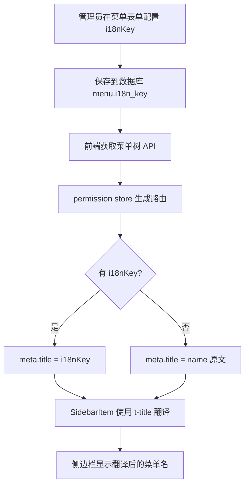

# 菜单国际化 Key 配置方案

## 1. 问题分析

### 当前现状
- 菜单表 `menu` 的 `name` 字段直接存储中文文本（如"系统管理"、"用户管理"）
- 前端通过硬编码的 `web/src/i18n/zh-CN/menu.ts` 和 `web/src/i18n/en/menu.ts` 做路由名称到翻译的映射
- 面包屑组件 `Breadcrumb.vue` 通过 `t('menu.${name}')` 尝试翻译，但依赖路由 name 匹配
- **问题**：菜单管理界面无法配置国际化 key，新增菜单时无法指定多语言翻译标识

### 目标
- 菜单表增加 `i18n_key` 字段，存储国际化翻译 key
- 菜单管理表单支持配置国际化 key
- 前端侧边栏、面包屑等组件优先使用 `i18n_key` 进行翻译，无 key 时回退到 `name` 原文

## 2. 数据流设计



## 3. 改动范围

### 3.1 后端改动

| 文件 | 改动内容 |
|------|----------|
| `server/model/entity/menu.go` | Menu 结构体增加 `I18nKey` 字段 |
| `server/model/request/menu.go` | MenuCreateRequest 和 MenuUpdateRequest 增加 `I18nKey` 字段 |
| `server/model/response/menu.go` | MenuResponse 增加 `I18nKey` 字段 |
| `server/service/menu.go` | Create、Update、toMenuResponse、buildTree 处理 I18nKey |
| `server/sql/init.sql` | menu 表增加 `i18n_key` 列 |
| `server/sql/seed.sql` | 为现有菜单数据补充 i18n_key 值 |

### 3.2 前端改动

| 文件 | 改动内容 |
|------|----------|
| `web/src/types/api.d.ts` | MenuItem 和 MenuFormData 增加 `i18nKey` 字段 |
| `web/src/views/system/menu/components/MenuForm.vue` | 表单增加国际化 key 输入框 |
| `web/src/views/system/menu/index.vue` | 列表增加国际化 key 列展示 |
| `web/src/store/modules/permission.ts` | 路由生成时使用 i18nKey 设置 meta.title |
| `web/src/layout/components/SidebarItem.vue` | 使用 i18n 翻译显示菜单标题 |
| `web/src/components/Breadcrumb.vue` | 适配 i18nKey 优先翻译 |
| `web/src/i18n/zh-CN/modules/menu.ts` | 增加 i18nKey 相关翻译 |
| `web/src/i18n/en/modules/menu.ts` | 增加 i18nKey 相关翻译 |

## 4. 详细设计

### 4.1 数据库字段

```sql
-- menu 表新增字段
ALTER TABLE {{.TablePrefix}}menu ADD COLUMN i18n_key VARCHAR(128) DEFAULT '';
```

字段说明：
- `i18n_key`：国际化翻译 key，如 `menu.system`、`menu.user`、`menu.role` 等
- 为空时回退使用 `name` 原文显示

### 4.2 种子数据 i18n_key 映射

| 菜单名称 | i18n_key |
|----------|----------|
| 系统管理 | menu.system |
| 用户管理 | menu.user |
| 用户查询 | menu.user.query |
| 用户新增 | menu.user.add |
| 用户修改 | menu.user.edit |
| 用户删除 | menu.user.delete |
| 角色管理 | menu.role |
| 角色查询 | menu.role.query |
| 角色新增 | menu.role.add |
| 角色修改 | menu.role.edit |
| 角色删除 | menu.role.delete |
| 菜单管理 | menu.menu |
| 菜单查询 | menu.menu.query |
| 菜单新增 | menu.menu.add |
| 菜单修改 | menu.menu.edit |
| 菜单删除 | menu.menu.delete |
| 部门管理 | menu.dept |
| 部门查询 | menu.dept.query |
| 部门新增 | menu.dept.add |
| 部门修改 | menu.dept.edit |
| 部门删除 | menu.dept.delete |
| 系统监控 | menu.monitor |
| 服务器监控 | menu.server |
| 操作日志 | menu.operationLog |
| 登录日志 | menu.loginLog |
| 系统工具 | menu.tool |
| 代码生成 | menu.codegen |

### 4.3 前端国际化翻译文件更新

**zh-CN/menu.ts** 增加按钮类翻译：
```typescript
export default {
  menu: {
    // ... 现有翻译保持不变
    // 新增按钮类翻译
    userQuery: '用户查询',
    userAdd: '用户新增',
    userEdit: '用户修改',
    userDelete: '用户删除',
    roleQuery: '角色查询',
    roleAdd: '角色新增',
    roleEdit: '角色修改',
    roleDelete: '角色删除',
    menuQuery: '菜单查询',
    menuAdd: '菜单新增',
    menuEdit: '菜单修改',
    menuDelete: '菜单删除',
    deptQuery: '部门查询',
    deptAdd: '部门新增',
    deptEdit: '部门修改',
    deptDelete: '部门删除',
  },
}
```

**en/menu.ts** 增加按钮类翻译：
```typescript
export default {
  menu: {
    // ... 现有翻译保持不变
    userQuery: 'User Query',
    userAdd: 'User Add',
    userEdit: 'User Edit',
    userDelete: 'User Delete',
    roleQuery: 'Role Query',
    roleAdd: 'Role Add',
    roleEdit: 'Role Edit',
    roleDelete: 'Role Delete',
    menuQuery: 'Menu Query',
    menuAdd: 'Menu Add',
    menuEdit: 'Menu Edit',
    menuDelete: 'Menu Delete',
    deptQuery: 'Dept Query',
    deptAdd: 'Dept Add',
    deptEdit: 'Dept Edit',
    deptDelete: 'Dept Delete',
  },
}
```

### 4.4 前端路由生成逻辑

在 `permission.ts` 的 `convertMenusToRoutes` 中：
```typescript
meta: {
  title: menu.i18nKey || menu.name,  // 优先使用 i18nKey
  icon: menu.icon,
  hidden: menu.visible === 0,
  sort: menu.sort,
  i18nKey: menu.i18nKey,  // 额外存储 i18nKey 供面包屑使用
}
```

### 4.5 侧边栏翻译逻辑

`SidebarItem.vue` 中显示标题时：
```vue
<span>{{ item.meta?.i18nKey ? t(item.meta.i18nKey) : item.meta?.title }}</span>
```

### 4.6 面包屑翻译逻辑

`Breadcrumb.vue` 的 `getBreadcrumbTitle` 方法：
```typescript
function getBreadcrumbTitle(item: RouteLocationMatched): string {
  const i18nKey = item.meta?.i18nKey as string
  const title = item.meta?.title as string
  if (i18nKey) {
    const translated = t(i18nKey, title)
    return translated !== i18nKey ? translated : title
  }
  // 原有逻辑回退
  const name = typeof item.name === 'string' ? item.name : ''
  const translated = name ? t(`menu.${name}`, title) : title
  return translated !== `menu.${name}` ? translated : title
}
```

## 5. 实施步骤

1. **后端实体和请求响应**：entity、request、response 增加 I18nKey 字段
2. **后端服务层**：service 层处理 I18nKey 的创建和更新
3. **数据库**：init.sql 增加列定义，seed.sql 补充种子数据
4. **前端类型定义**：api.d.ts 增加 i18nKey 字段
5. **前端菜单表单**：MenuForm.vue 增加国际化 key 输入框
6. **前端菜单列表**：menu/index.vue 增加国际化 key 列
7. **前端路由生成**：permission.ts 使用 i18nKey
8. **前端侧边栏**：SidebarItem.vue 使用 i18n 翻译
9. **前端面包屑**：Breadcrumb.vue 适配 i18nKey
10. **国际化文件**：zh-CN 和 en 的 menu.ts 增加翻译
