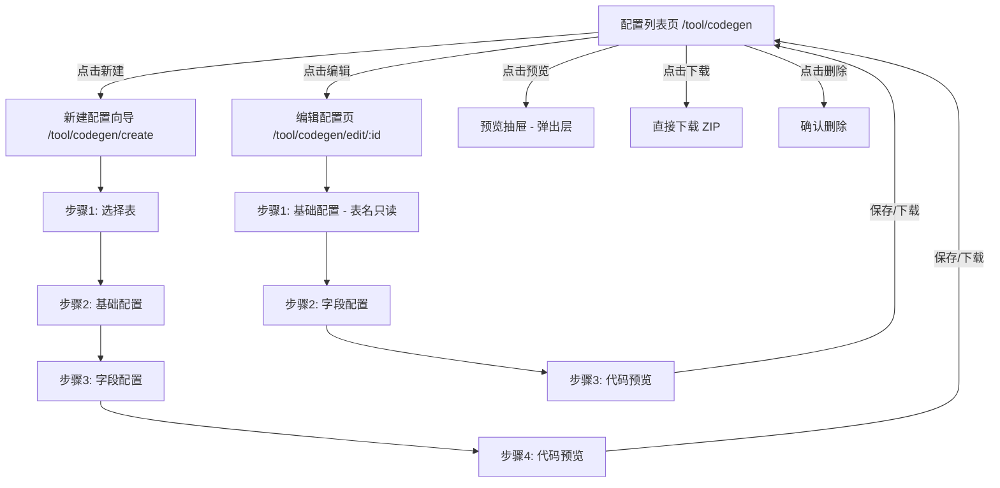
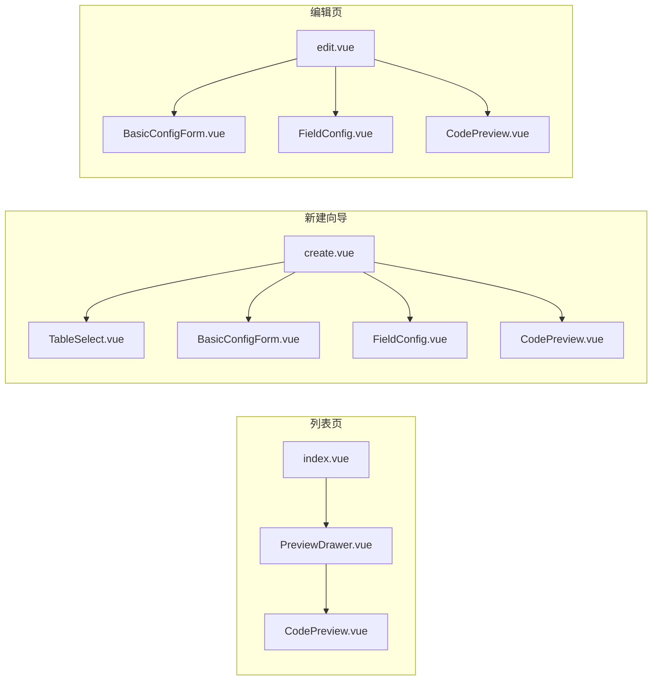

# 代码生成页面重构方案

## 1. 背景与目标

### 当前问题
- 代码生成是一个单一的线性向导页面（4步：选表 → 基础配置 → 字段配置 → 代码预览）
- "加载配置"按钮藏在步骤2的 header 里，用户必须先选表才能加载已有配置
- 没有配置列表视图，用户无法快速查看、管理已保存的配置
- 每次使用都需要从头走完4步流程，效率低

### 设计目标
- 用户可以直接从已保存的配置列表进入编辑，跳过选表步骤
- 新建配置时走完整的4步向导（与现有逻辑一致）
- 列表页支持搜索/筛选、编辑、删除、预览（抽屉）、下载

## 2. 页面结构设计

### 2.1 整体架构（方案 A：列表页 + 编辑页）

```
/tool/codegen              → 配置列表页（index.vue）
/tool/codegen/create       → 新建配置向导（create.vue）- 4步
/tool/codegen/edit/:id     → 编辑配置页（edit.vue）- 3步（基础配置 → 字段配置 → 代码预览）
```

### 2.2 页面流程图



### 2.3 列表页设计

**表格列：**
| 列名 | 字段 | 说明 |
|------|------|------|
| 表名 | tableName | 数据库表名 |
| 表描述 | tableComment | 表注释 |
| 类名 | className | 大驼峰类名 |
| 业务名 | businessName | 小驼峰业务名 |
| 功能名 | functionName | 中文功能名 |
| 模块名 | moduleName | 模块名 |
| 作者 | author | 作者 |
| 创建时间 | createdAt | 创建时间 |

**操作列：**
- 编辑 → 跳转到 `/tool/codegen/edit/:id`
- 预览 → 打开抽屉，内含 CodePreview 组件
- 下载 → 直接调用 generate API 下载 ZIP
- 删除 → 确认后删除

**顶部操作：**
- 搜索框：按表名/类名/业务名模糊搜索
- 新建配置按钮 → 跳转到 `/tool/codegen/create`

### 2.4 新建配置向导（create.vue）

完整的4步向导，与现有 `index.vue` 逻辑一致：
1. **选择表** - TableSelect 组件
2. **基础配置** - 表单（表名、表描述、类名、业务名、功能名、模块名、包名、作者）
3. **字段配置** - FieldConfig 组件
4. **代码预览** - CodePreview 组件

底部操作栏：上一步、重置、保存配置、下一步/下载代码

### 2.5 编辑配置页（edit.vue）

3步向导（跳过选表步骤）：
1. **基础配置** - 表单，表名字段只读展示
2. **字段配置** - FieldConfig 组件
3. **代码预览** - CodePreview 组件

底部操作栏：上一步、重置、保存配置、下一步/下载代码

页面加载时通过路由参数 `:id` 获取配置数据，直接填充表单。

## 3. 路由方案

### 3.1 路由注册方式

利用现有的动态路由 + 静态隐藏路由结合：

- **动态路由**（来自后端菜单）：`/tool/codegen` → `tool/codegen/index.vue`（列表页）
- **静态隐藏路由**（添加到 `staticRoutes.ts`）：
  - `/tool/codegen/create` → `tool/codegen/create.vue`
  - `/tool/codegen/edit/:id` → `tool/codegen/edit.vue`

这样不需要修改后端菜单数据，create 和 edit 页面通过列表页的按钮导航访问。

### 3.2 静态路由配置

在 `staticRoutes.ts` 中添加：

```typescript
{
  path: '/tool',
  component: Layout,
  meta: { hidden: true },
  children: [
    {
      path: 'codegen/create',
      name: 'CodegenCreate',
      component: () => import('@/views/tool/codegen/create.vue'),
      meta: { title: '新建配置', hidden: true },
    },
    {
      path: 'codegen/edit/:id',
      name: 'CodegenEdit',
      component: () => import('@/views/tool/codegen/edit.vue'),
      meta: { title: '编辑配置', hidden: true },
    },
  ],
},
```

## 4. 组件拆分

### 4.1 文件结构

```
web/src/views/tool/codegen/
├── index.vue                    # 配置列表页（新）
├── create.vue                   # 新建配置向导（新）
├── edit.vue                     # 编辑配置页（新）
└── components/
    ├── TableSelect.vue          # 选择表组件（复用，不变）
    ├── FieldConfig.vue          # 字段配置组件（复用，不变）
    ├── CodePreview.vue          # 代码预览组件（复用，不变）
    ├── BasicConfigForm.vue      # 基础配置表单（新 - 从 index.vue 中提取）
    └── PreviewDrawer.vue        # 预览抽屉组件（新 - 列表页用）
```

### 4.2 组件职责

| 组件 | 职责 | 来源 |
|------|------|------|
| `index.vue` | 配置列表页，展示所有已保存配置，提供搜索/筛选/编辑/预览/下载/删除操作 | 新建 |
| `create.vue` | 新建配置向导，4步流程 | 从现有 index.vue 重构 |
| `edit.vue` | 编辑配置页，3步流程（跳过选表） | 新建 |
| `BasicConfigForm.vue` | 基础配置表单（表名、类名、业务名等），create 和 edit 共用 | 从 index.vue 提取 |
| `TableSelect.vue` | 数据库表选择下拉框 | 不变 |
| `FieldConfig.vue` | 字段配置表格 | 不变 |
| `CodePreview.vue` | 代码预览（文件树 + 代码高亮） | 不变 |
| `PreviewDrawer.vue` | 预览抽屉，包裹 CodePreview 组件，供列表页使用 | 新建 |

### 4.3 组件复用关系



## 5. 后端变更

### 5.1 现有 API 清单（无需修改）

| API | 方法 | 路径 | 说明 |
|-----|------|------|------|
| 获取表列表 | GET | `/codegen/tables` | 不变 |
| 获取列信息 | GET | `/codegen/columns/:tableName` | 不变 |
| 代码预览 | POST | `/codegen/preview` | 不变 |
| 生成代码 | POST | `/codegen/generate` | 不变 |
| 保存配置 | POST | `/codegen/config` | 不变 |
| 获取配置 | GET | `/codegen/config/:tableName` | 不变 |
| 获取所有配置 | GET | `/codegen/configs` | 不变 |
| 删除配置 | DELETE | `/codegen/config/:id` | 不变 |

### 5.2 需要新增的 API

| API | 方法 | 路径 | 说明 |
|-----|------|------|------|
| 根据ID获取配置 | GET | `/codegen/config/id/:id` | 编辑页需要通过 ID 加载配置 |

**原因：** 现有的 `getConfig` 是按 tableName 查询的，但编辑页通过路由参数 `:id`（配置ID）访问，需要一个按 ID 查询的接口。

### 5.3 后端实现变更

**`server/router/codegen.go`** - 新增路由：
```go
codegenGroup.GET("/config/id/:id", codegenCtrl.GetConfigByID)
```

**`server/controller/codegen.go`** - 新增方法：
```go
func (ctrl *CodegenController) GetConfigByID(c *gin.Context) { ... }
```

**`server/service/codegen.go`** - 新增方法：
```go
func (s *CodegenService) GetConfigByID(id int64) (*response.CodegenConfigResponse, error) { ... }
```

**`server/repository/codegen.go`** - 新增方法：
```go
func (r *CodegenRepository) GetConfigByID(id int64) (*entity.CodegenConfig, error) { ... }
```

## 6. 前端 API 变更

**`web/src/api/codegen.ts`** - 新增：
```typescript
/** 根据ID获取代码生成配置 */
export function getConfigById(id: number) {
  return request.get<ApiResponse<CodegenConfig>>(`/codegen/config/id/${id}`)
}
```

## 7. i18n 变更

**新增翻译 key：**

| Key | 中文 | 英文 |
|-----|------|------|
| `codegen.configList` | 已保存配置 | Saved Configs |
| `codegen.createConfig` | 新建配置 | Create Config |
| `codegen.editConfig` | 编辑配置 | Edit Config |
| `codegen.searchPlaceholder` | 搜索表名/类名/业务名 | Search by table/class/business name |
| `codegen.deleteConfirm` | 确定要删除该配置吗？ | Are you sure to delete this config? |
| `codegen.tableNameReadonly` | 表名不可更改 | Table name cannot be changed |

## 8. 实施步骤

### 步骤 1：后端 - 新增按 ID 获取配置的 API
- `server/repository/codegen.go` - 新增 `GetConfigByID` 方法
- `server/service/codegen.go` - 新增 `GetConfigByID` 方法
- `server/controller/codegen.go` - 新增 `GetConfigByID` 控制器方法
- `server/router/codegen.go` - 注册新路由

### 步骤 2：前端 API 层
- `web/src/api/codegen.ts` - 新增 `getConfigById` 函数

### 步骤 3：前端 - 提取 BasicConfigForm 组件
- 从现有 `index.vue` 中提取基础配置表单为独立组件 `BasicConfigForm.vue`
- 支持 `readonly` 模式（编辑页表名只读）

### 步骤 4：前端 - 创建 PreviewDrawer 组件
- 新建 `PreviewDrawer.vue`，包裹 `CodePreview` 组件
- 支持通过抽屉形式展示代码预览

### 步骤 5：前端 - 创建列表页
- 重写 `index.vue` 为配置列表页
- 包含搜索/筛选、表格展示、操作按钮（编辑/预览/下载/删除）

### 步骤 6：前端 - 创建新建配置向导
- 新建 `create.vue`，从现有 `index.vue` 迁移4步向导逻辑
- 使用 `BasicConfigForm` 组件替代内联表单

### 步骤 7：前端 - 创建编辑配置页
- 新建 `edit.vue`，3步向导（基础配置 → 字段配置 → 代码预览）
- 通过路由参数 `:id` 加载配置数据
- 表名字段只读

### 步骤 8：前端 - 注册静态路由
- `web/src/router/staticRoutes.ts` - 添加 create 和 edit 的隐藏路由

### 步骤 9：前端 - 更新 i18n
- `web/src/i18n/zh-CN/modules/codegen.ts` - 新增翻译
- `web/src/i18n/en/modules/codegen.ts` - 新增翻译

### 步骤 10：清理
- 删除旧的 `index.vue` 中的向导逻辑（已被 create.vue 替代）
- 确保所有组件引用正确
