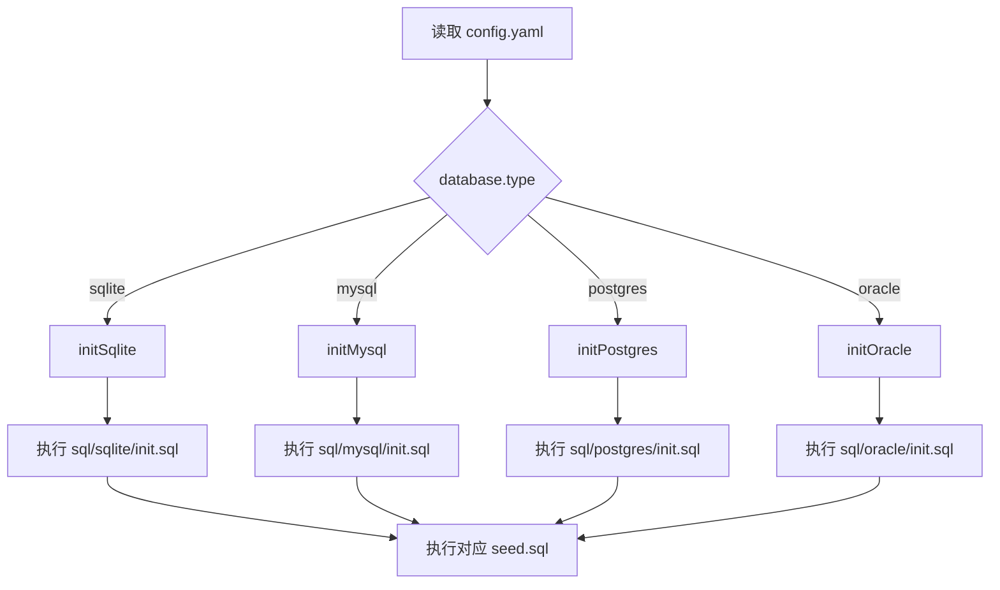
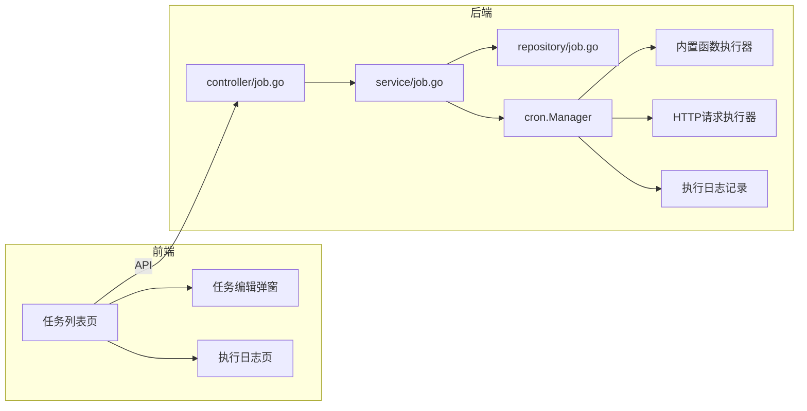
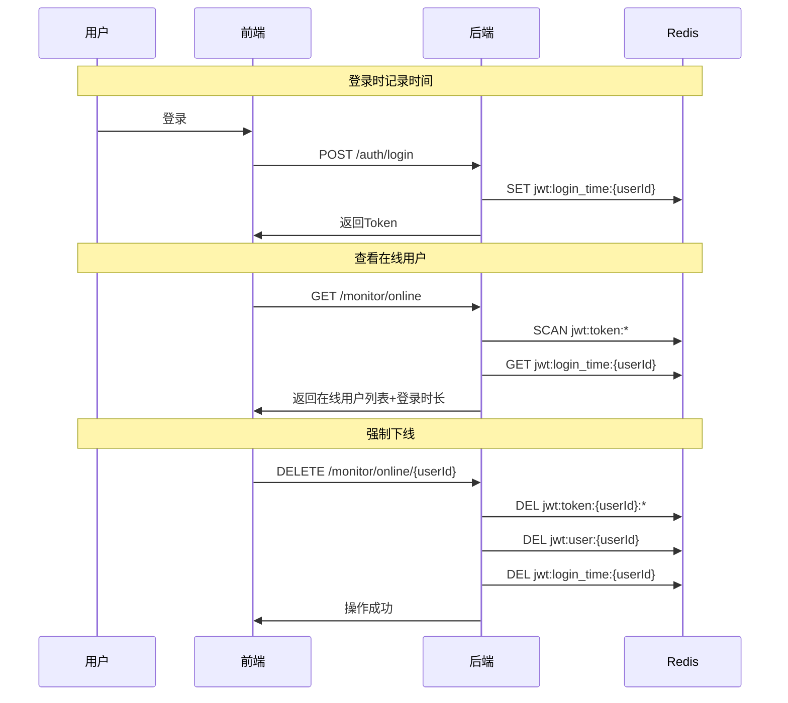
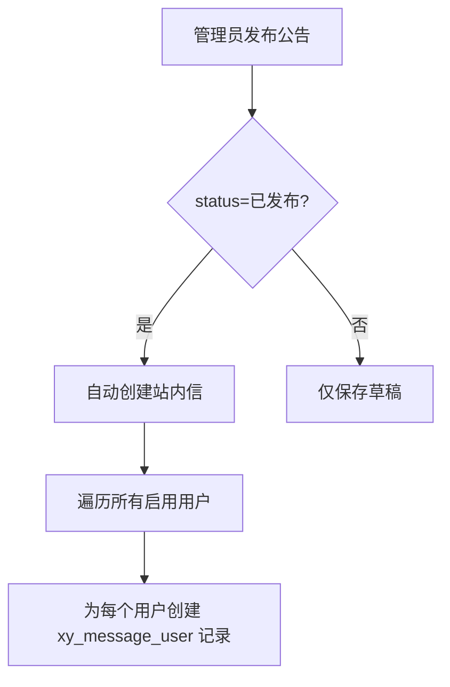
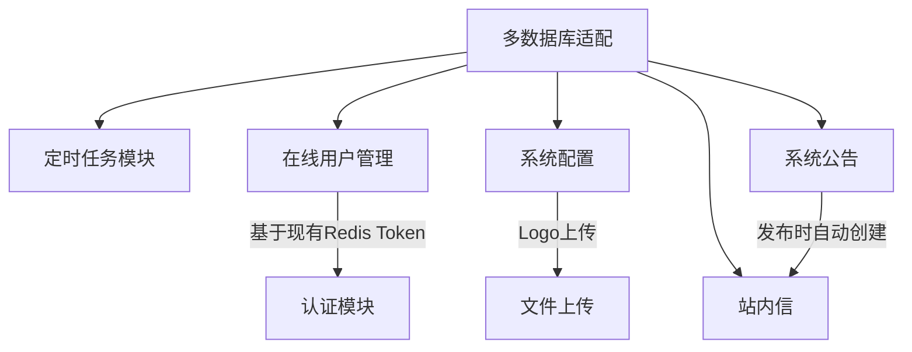

# 第二阶段需求实现计划

## 需求概览

| 序号 | 需求 | 状态 |
|------|------|------|
| 5 | 多数据库适配（MySQL/PostgreSQL/Oracle） | 待开发 |
| 6 | 定时任务模块 | 待开发 |
| 7 | 在线用户管理（在线用户、登录时长、强制下线） | 待开发 |
| 8.1 | 系统配置（标题、版权、Logo） | 待开发 |
| 8.2 | 系统公告 | 待开发 |
| 8.3 | 站内信 | 待开发 |

---

## 一、多数据库适配

### 设计决策

- **SQL文件管理**：各数据库独立维护 `init.sql` 和 `seed.sql`，按文件夹分类
- **驱动选择**：纯Go驱动，无需CGO
  - MySQL: `github.com/go-sql-driver/mysql` + `gorm.io/driver/mysql`
  - PostgreSQL: `github.com/jackc/pgx` + `gorm.io/driver/postgres`
  - Oracle: `github.com/sijms/go-ora` + `gorm.io/driver/oracle`（或自定义）

### 目录结构

```
server/sql/
├── sqlite/
│   ├── init.sql          ← 迁移自 sql/init.sql
│   └── seed.sql          ← 迁移自 sql/seed.sql
├── mysql/
│   ├── init.sql          ← MySQL DDL（AUTO_INCREMENT等）
│   └── seed.sql          ← MySQL 种子数据
├── postgres/
│   ├── init.sql          ← PostgreSQL DDL（SERIAL等）
│   └── seed.sql          ← PostgreSQL 种子数据
└── oracle/
    ├── init.sql          ← Oracle DDL（SEQUENCE等）
    └── seed.sql          ← Oracle 种子数据
```

### 核心改动

1. **`server/initialize/db.go`** - 修改 `DB()` 函数，根据 `config.Database.Type` 路由到对应初始化函数
2. **`server/config/config.go`** - 已有 `Database.Type` 字段，无需修改
3. **SQL模板路径** - `executeSQLTemplate()` 函数改为根据数据库类型拼接路径

### 数据库切换流程



---

## 二、定时任务模块

### 设计决策

- **调度库**：`robfig/cron/v3`（进程内执行，轻量）
- **任务类型**：内置函数 + HTTP请求
- **任务管理**：数据库持久化 + 运行时热更新

### 数据表设计

```sql
-- 定时任务表
CREATE TABLE xy_job (
    id INTEGER PRIMARY KEY AUTOINCREMENT,
    name VARCHAR(128) NOT NULL,           -- 任务名称
    job_type INTEGER DEFAULT 1,            -- 1=内置函数 2=HTTP请求
    cron_expr VARCHAR(64) NOT NULL,        -- cron表达式
    func_name VARCHAR(128),                -- 内置函数名
    http_url VARCHAR(512),                 -- HTTP地址
    http_method VARCHAR(10) DEFAULT 'GET', -- GET/POST
    http_body TEXT,                        -- 请求体
    status INTEGER DEFAULT 1,              -- 1=启用 0=禁用
    remark VARCHAR(512),
    created_by INTEGER DEFAULT 0,
    updated_by INTEGER DEFAULT 0,
    created_at DATETIME,
    updated_at DATETIME,
    deleted_at DATETIME
);

-- 任务执行日志表
CREATE TABLE xy_job_log (
    id INTEGER PRIMARY KEY AUTOINCREMENT,
    job_id INTEGER NOT NULL,               -- 任务ID
    status INTEGER DEFAULT 1,              -- 1=成功 2=失败
    result TEXT,                           -- 执行结果
    error_msg TEXT,                        -- 错误信息
    duration INTEGER,                      -- 执行耗时ms
    created_at DATETIME
);
```

### 模块架构



### 内置函数注册表

```go
// 预定义的内置任务函数
var builtinJobs = map[string]func(){
    "clean_operation_log": CleanOperationLog,  // 清理操作日志
    "clean_login_log":     CleanLoginLog,      // 清理登录日志
}
```

---

## 三、在线用户管理

### 设计决策

- **存储**：纯Redis实现，不新增数据库表
- **登录时长**：Redis记录登录时间戳
- **强制下线**：删除Redis Token key

### Redis Key 设计

```
jwt:token:{userId}:{uuid}     -> accessToken    (已有)
jwt:user:{userId}             -> uuid            (已有)
jwt:login_time:{userId}       -> unix_timestamp  (新增)
```

### 核心流程



---

## 四、系统配置

### 设计决策

- **存储模式**：Key-Value
- **Logo上传**：本地文件存储
- **运行时生效**：修改后立即生效，无需重启

### 数据表设计

```sql
CREATE TABLE xy_system_config (
    id INTEGER PRIMARY KEY AUTOINCREMENT,
    config_key VARCHAR(128) NOT NULL UNIQUE,
    config_value TEXT,
    config_type VARCHAR(32) DEFAULT 'text',  -- text/image/json
    remark VARCHAR(512),
    created_by INTEGER DEFAULT 0,
    updated_by INTEGER DEFAULT 0,
    created_at DATETIME,
    updated_at DATETIME
);
```

### 预置配置项

| config_key | 说明 | config_type |
|------------|------|-------------|
| system_title | 系统标题 | text |
| system_copyright | 版权信息 | text |
| system_logo | Logo图片路径 | image |
| system_favicon | Favicon路径 | image |

---

## 五、系统公告

### 数据表设计

```sql
CREATE TABLE xy_announcement (
    id INTEGER PRIMARY KEY AUTOINCREMENT,
    title VARCHAR(256) NOT NULL,
    content TEXT,                           -- Markdown格式
    type INTEGER DEFAULT 1,                 -- 1=通知 2=公告
    status INTEGER DEFAULT 1,               -- 1=草稿 2=已发布 3=已撤回
    top INTEGER DEFAULT 0,                  -- 0=不置顶 1=置顶
    publish_by INTEGER,
    publish_at DATETIME,
    created_by INTEGER DEFAULT 0,
    updated_by INTEGER DEFAULT 0,
    created_at DATETIME,
    updated_at DATETIME,
    deleted_at DATETIME
);
```

### 公告与站内信联动



---

## 六、站内信

### 数据表设计

```sql
-- 消息表
CREATE TABLE xy_message (
    id INTEGER PRIMARY KEY AUTOINCREMENT,
    sender_id INTEGER NOT NULL,             -- 发送人ID 0=系统
    title VARCHAR(256),
    content TEXT,
    msg_type INTEGER DEFAULT 1,             -- 1=个人消息 2=系统消息 3=公告消息
    created_at DATETIME,
    deleted_at DATETIME
);

-- 消息-用户关联表
CREATE TABLE xy_message_user (
    id INTEGER PRIMARY KEY AUTOINCREMENT,
    message_id INTEGER NOT NULL,
    receiver_id INTEGER NOT NULL,
    is_read INTEGER DEFAULT 0,              -- 0=未读 1=已读
    read_at DATETIME,
    created_at DATETIME
);
```

### 未读消息提醒

- 前端每30秒轮询 `GET /message/unread-count`
- 导航栏显示未读消息数量角标
- 点击进入消息列表页

---

## 模块依赖关系



## 开发顺序建议

1. **多数据库适配** - 基础设施，优先完成
2. **系统配置** - 独立模块，无依赖
3. **在线用户管理** - 基于现有Redis，改动小
4. **站内信** - 先完成基础消息功能
5. **系统公告** - 依赖站内信（发布时自动推送）
6. **定时任务** - 最复杂的模块，最后完成
7. **集成测试** - 全部完成后统一测试
