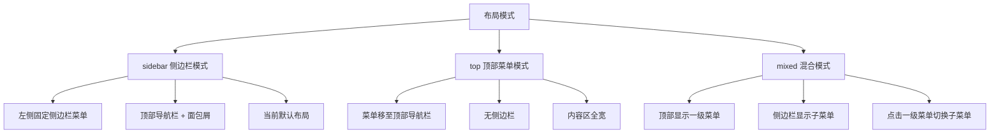
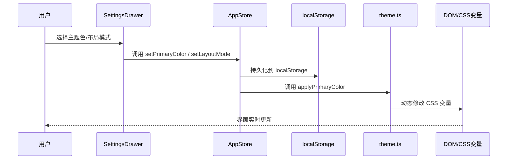

# 主题颜色与导航栏布局切换方案

## 一、需求概述

在前台增加以下配置功能，所有配置缓存在浏览器 localStorage 中：

1. **主题颜色切换**：预设一组主题色（蓝色、绿色、紫色、橙色等），用户从色板中选择
2. **导航栏布局样式切换**：支持三种布局模式
   - 侧边栏菜单模式（当前默认）
   - 顶部菜单模式（菜单移到顶部导航栏）
   - 混合模式（顶部一级菜单 + 侧边栏子菜单）

## 二、现有架构分析

### 2.1 主题系统
- [`theme.ts`](web/src/utils/theme.ts) 已支持 light/dark 模式切换，使用 localStorage 存储
- [`variables.css`](web/src/assets/styles/variables.css) 定义了完整的明暗主题 CSS 变量
- [`main.ts`](web/src/main.ts) 在应用启动时调用 `initTheme()` 初始化主题

### 2.2 状态管理
- [`app.ts`](web/src/store/modules/app.ts) 管理 sidebar、device、theme、language、size 等状态
- [`store.d.ts`](web/src/types/store.d.ts) 定义了 AppState 类型

### 2.3 布局结构
- [`layout/index.vue`](web/src/layout/index.vue) 固定侧边栏 + 主内容区布局
- [`Navbar.vue`](web/src/layout/components/Navbar.vue) 已有主题切换、语言切换、全屏等功能
- [`Sidebar.vue`](web/src/layout/components/Sidebar.vue) 固定左侧侧边栏菜单
- [`TagsView.vue`](web/src/layout/components/TagsView.vue) 标签页导航
- [`AppMain.vue`](web/src/layout/components/AppMain.vue) 内容区

### 2.4 国际化
- [`zh-CN/modules/layout.ts`](web/src/i18n/zh-CN/modules/layout.ts) 中文翻译
- [`en/modules/layout.ts`](web/src/i18n/en/modules/layout.ts) 英文翻译

## 三、技术方案设计

### 3.1 主题颜色方案

#### 预设主题色列表

| 名称 | 颜色值 | 说明 |
|------|--------|------|
| 极光蓝 | `#4096ff` | 默认主题色 |
| 翡翠绿 | `#52c41a` | 清新绿 |
| 星空紫 | `#722ed1` | 优雅紫 |
| 落日橙 | `#fa8c16` | 温暖橙 |
| 玫瑰红 | `#f5222d` | 热情红 |
| 天际青 | `#13c2c2` | 清爽青 |
| 暗夜黑 | `#434343` | 沉稳黑 |

#### 实现原理

通过 JavaScript 动态修改 CSS 变量 `--el-color-primary` 及其派生色（light-3/5/7/8/9, dark-2），同时更新侧边栏激活色等关联变量。使用 Element Plus 提供的 `css-vars` 机制，无需重新编译 CSS。

### 3.2 布局模式方案

#### 三种布局模式



#### 布局模式详细说明

**1. 侧边栏模式（sidebar）** - 当前默认
- 左侧固定侧边栏显示完整菜单树
- 顶部导航栏包含：折叠按钮、面包屑、功能按钮
- 内容区有侧边栏偏移

**2. 顶部菜单模式（top）**
- 菜单移至顶部导航栏，水平排列
- 无侧边栏，内容区全宽
- 顶部导航栏包含：Logo、水平菜单、功能按钮
- 移动端自动降级为侧边栏模式

**3. 混合模式（mixed）**
- 顶部显示一级菜单（水平排列）
- 侧边栏显示当前一级菜单的子菜单
- 点击顶部一级菜单切换侧边栏内容
- 移动端自动降级为侧边栏模式

### 3.3 数据流设计



## 四、文件变更清单

### 4.1 新增文件

| 文件路径 | 说明 |
|----------|------|
| `web/src/layout/components/SettingsDrawer.vue` | 设置面板抽屉组件 |
| `web/src/layout/components/TopMenu.vue` | 顶部水平菜单组件 |

### 4.2 修改文件

| 文件路径 | 变更内容 |
|----------|----------|
| `web/src/types/store.d.ts` | 扩展 AppState 类型，新增 `layoutMode` 和 `primaryColor` |
| `web/src/utils/theme.ts` | 新增主题色预设列表、`applyPrimaryColor()`、`initPrimaryColor()` |
| `web/src/store/modules/app.ts` | 新增 `layoutMode` 和 `primaryColor` 状态及方法 |
| `web/src/assets/styles/variables.css` | 新增 `--sidebar-active-text` 等变量的动态绑定支持 |
| `web/src/layout/index.vue` | 重构支持三种布局模式 |
| `web/src/layout/components/Navbar.vue` | 添加设置按钮，适配顶部菜单模式 |
| `web/src/layout/components/Sidebar.vue` | 适配混合模式下只显示子菜单 |
| `web/src/i18n/zh-CN/modules/layout.ts` | 添加设置面板中文翻译 |
| `web/src/i18n/en/modules/layout.ts` | 添加设置面板英文翻译 |
| `web/src/main.ts` | 初始化主题色 |

## 五、详细实现步骤

### 步骤 1：扩展类型定义

修改 [`store.d.ts`](web/src/types/store.d.ts)，在 `AppState` 中新增：

```typescript
export type LayoutMode = 'sidebar' | 'top' | 'mixed'

export interface AppState {
  // ... 现有字段
  layoutMode: LayoutMode
  primaryColor: string
}
```

### 步骤 2：扩展主题工具

修改 [`theme.ts`](web/src/utils/theme.ts)，新增：

```typescript
// 预设主题色
export const PRESET_COLORS = [
  { name: '极光蓝', value: '#4096ff' },
  { name: '翡翠绿', value: '#52c41a' },
  { name: '星空紫', value: '#722ed1' },
  { name: '落日橙', value: '#fa8c16' },
  { name: '玫瑰红', value: '#f5222d' },
  { name: '天际青', value: '#13c2c2' },
  { name: '暗夜黑', value: '#434343' },
]

const PRIMARY_COLOR_KEY = 'primaryColor'

// 获取主题色
export function getPrimaryColor(): string

// 应用主题色到 DOM
export function applyPrimaryColor(color: string): void

// 初始化主题色
export function initPrimaryColor(): void
```

`applyPrimaryColor` 函数需要：
1. 计算主色的 light-3/5/7/8/9 和 dark-2 派生色
2. 设置 `document.documentElement.style.setProperty()` 更新 CSS 变量
3. 同时更新侧边栏相关变量（`--sidebar-active-text`、`--sidebar-hover-bg`、`--sidebar-active-bg`）

### 步骤 3：扩展 AppStore

修改 [`app.ts`](web/src/store/modules/app.ts)，新增：

```typescript
const layoutMode = ref<LayoutMode>(
  (localStorage.getItem('layoutMode') as LayoutMode) || 'sidebar'
)
const primaryColor = ref<string>(
  localStorage.getItem('primaryColor') || '#4096ff'
)

function setLayoutMode(mode: LayoutMode) { ... }
function setColor(color: string) { ... }
```

### 步骤 4：创建 SettingsDrawer 组件

新建 [`SettingsDrawer.vue`](web/src/layout/components/SettingsDrawer.vue)：

- 使用 `el-drawer` 从右侧滑出
- **主题颜色区域**：色块网格，点击选择，当前选中项有勾选标记
- **布局模式区域**：三个布局缩略图卡片，点击切换，当前选中项高亮
- **重置按钮**：恢复默认配置

### 步骤 5：修改 Navbar

修改 [`Navbar.vue`](web/src/layout/components/Navbar.vue)：

- 在功能区添加设置图标按钮（`Setting` 图标）
- 点击打开 SettingsDrawer
- 顶部菜单模式下，左侧区域改为显示 Logo + TopMenu

### 步骤 6：创建 TopMenu 组件

新建 [`TopMenu.vue`](web/src/layout/components/TopMenu.vue)：

- 水平排列的一级菜单，使用 `el-menu` 的 `mode="horizontal"`
- 支持子菜单下拉
- 当前激活菜单高亮

### 步骤 7：重构 Layout 组件

修改 [`layout/index.vue`](web/src/layout/index.vue)：

- 根据 `layoutMode` 动态切换布局结构
- `sidebar` 模式：保持现有布局
- `top` 模式：隐藏侧边栏，顶部显示 Logo + TopMenu + 功能按钮
- `mixed` 模式：顶部显示一级菜单，侧边栏显示子菜单

### 步骤 8：适配 Sidebar

修改 [`Sidebar.vue`](web/src/layout/components/Sidebar.vue)：

- 混合模式下，接收当前选中的一级菜单，只渲染其子菜单
- 通过 props 或 store 获取当前一级菜单的 children

### 步骤 9：更新国际化

修改 [`zh-CN/modules/layout.ts`](web/src/i18n/zh-CN/modules/layout.ts) 和 [`en/modules/layout.ts`](web/src/i18n/en/modules/layout.ts)：

```typescript
settings: {
  title: '系统设置' / 'Settings',
  themeColor: '主题颜色' / 'Theme Color',
  layoutMode: '布局模式' / 'Layout Mode',
  sidebarMode: '侧边栏模式' / 'Sidebar Mode',
  topMode: '顶部菜单模式' / 'Top Menu Mode',
  mixedMode: '混合模式' / 'Mixed Mode',
  reset: '重置默认' / 'Reset Default',
}
```

### 步骤 10：初始化主题色

修改 [`main.ts`](web/src/main.ts)，在 `initTheme()` 后调用 `initPrimaryColor()`。

## 六、布局模式结构图

### 6.1 侧边栏模式（sidebar）

```
┌─────────────────────────────────────────────┐
│  Navbar [☰] [Breadcrumb]    [🌙][🌐][👤]  │
├──────────┬──────────────────────────────────┤
│          │  TagsView                        │
│ Sidebar  ├──────────────────────────────────┤
│          │                                  │
│  Menu    │  AppMain                         │
│  Items   │                                  │
│          │                                  │
└──────────┴──────────────────────────────────┘
```

### 6.2 顶部菜单模式（top）

```
┌─────────────────────────────────────────────┐
│  [Logo] [Menu1] [Menu2] [Menu3]  [🌙][🌐][👤] │
├─────────────────────────────────────────────┤
│  TagsView                                   │
├─────────────────────────────────────────────┤
│                                             │
│  AppMain                                    │
│                                             │
│                                             │
└─────────────────────────────────────────────┘
```

### 6.3 混合模式（mixed）

```
┌─────────────────────────────────────────────┐
│  [Logo] [Menu1] [Menu2] [Menu3]  [🌙][🌐][👤] │
├──────────┬──────────────────────────────────┤
│          │  TagsView                        │
│ SubMenu  ├──────────────────────────────────┤
│          │                                  │
│  Items   │  AppMain                         │
│          │                                  │
│          │                                  │
└──────────┴──────────────────────────────────┘
```

## 七、注意事项

1. **移动端适配**：顶部菜单模式和混合模式在移动端（< 768px）自动降级为侧边栏模式
2. **主题色派生**：需要实现颜色混合算法，根据主色计算 light-3/5/7/8/9 和 dark-2
3. **Element Plus 兼容**：通过修改 CSS 变量实现，与 Element Plus 的 `css-vars` 机制兼容
4. **暗黑模式兼容**：主题色切换需要同时考虑 light/dark 两种模式下的表现
5. **性能考虑**：CSS 变量修改是同步操作，不会引起页面重排
6. **路由兼容**：布局模式切换不应影响当前路由和标签页状态
